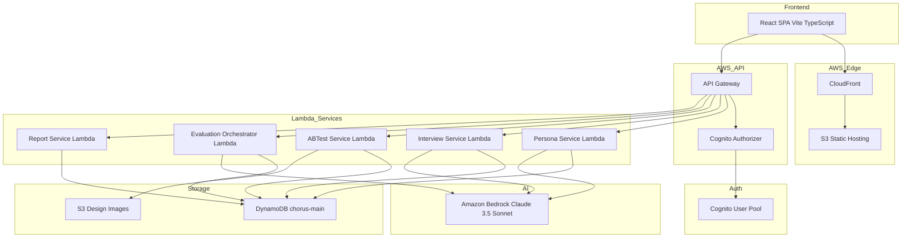
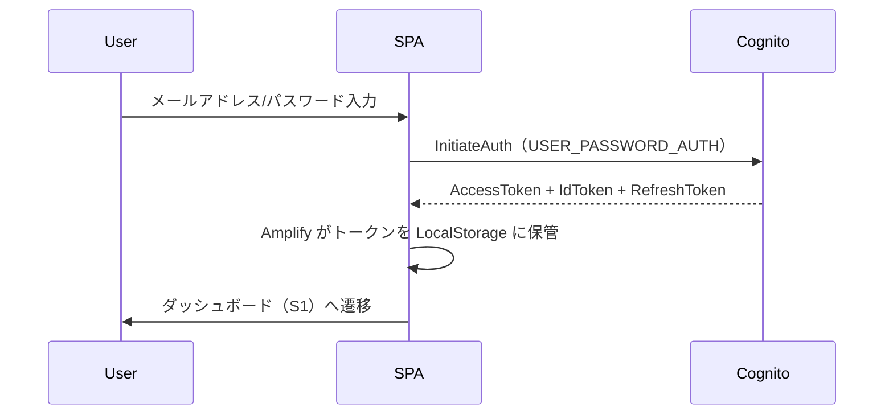
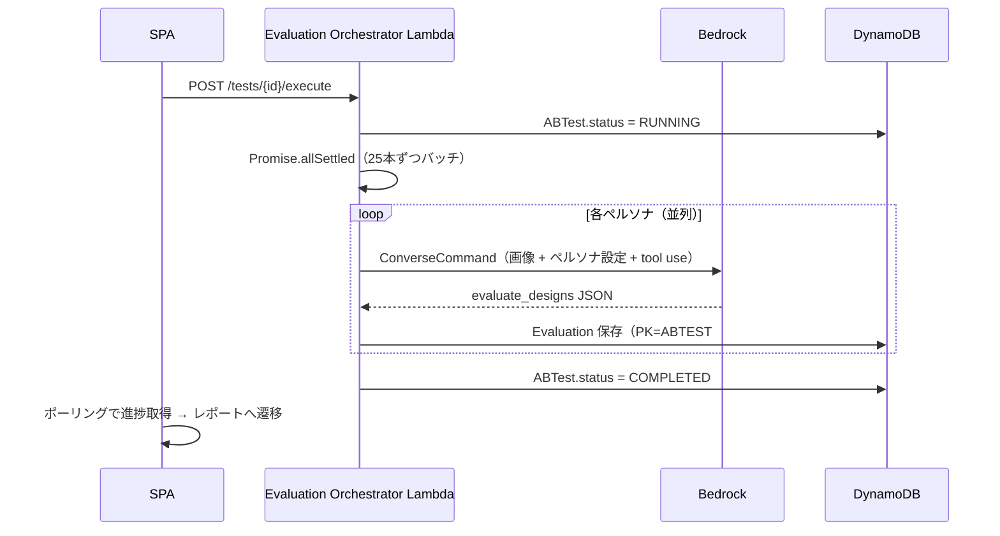
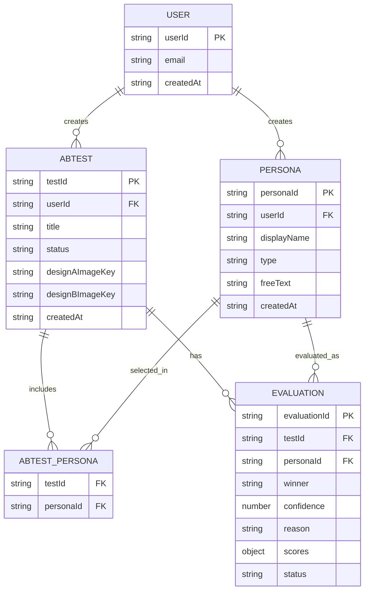

# Design Document — Chorus: AIペルソナによるデザインA/Bテストツール

## Overview

Chorus は、デザイナーが 2 つのデザイン案（A案/B案）を自身が定義した AIペルソナ群に自動でUXレビューさせ、定量（支持率・評価軸スコア）と定性（理由コメント）の両面で勝敗を受け取る Web アプリケーションである。

フロントエンドは Vite + React + TypeScript による SPA で構成し、ホスティングは環境によって異なる（開発: Cloudflare Pages、本番: S3 + CloudFront）。バックエンドは Amazon API Gateway + AWS Lambda（TypeScript）のサーバーレスアーキテクチャとする。AI評価の並列ファンアウトは Evaluation Orchestrator Lambda が `Promise.allSettled` で各ペルソナの Bedrock 呼び出しを並列実行する。ユーザーデータは Amazon DynamoDB 単一テーブル設計で永続化し、デザイン画像は Amazon S3 に保管する。認証は Amazon Cognito User Pool（OAuth 2.0 + PKCE）で行う。

**Purpose**: デザイナーが主観と推測ではなく、多様なペルソナ視点に基づく定量・定性データで意思決定を行えるようにする。  
**Users**: 個人デザイナー・デザインチームメンバー。  
**Impact**: 新規プロダクトのフル実装。既存システムへの変更なし。

### Goals

- デザイン画像アップロードのみでコア機能（作成→評価→レポート）を完結できるMVPの提供
- 最大100ペルソナの並列AI評価を非同期・進捗表示付きで実行
- DynamoDB + S3 + Cognito によるユーザーデータの完全分離と最小権限

### Non-Goals

- 複数ユーザーの共同編集・権限ロール管理
- 課金・請求機能
- A/B以外の多変量テスト/
- モバイルネイティブアプリ
- ペルソナのマーケットプレイス公開
- 実ユーザー行動ログ収集
- Figma OAuth連携・サイトURLスクリーンショット（フェーズ2/3として拡張点を確保）

---

## Boundary Commitments

### This Spec Owns

- 認証フロー（Cognito User Pool + @aws-amplify/auth v6）
- ペルソナのCRUD、AIアシスト下書き生成、インタビューチャット
- A/Bテストの作成・入力（画像アップロード、MVP）
- AI評価の並列実行オーケストレーション（Evaluation Orchestrator Lambda + Promise.allSettled）
- 結果レポートの集計・可視化
- DynamoDB 単一テーブル設計（全エンティティ）
- S3 デザイン画像ストレージ
- AWS CDK TypeScript によるインフラ定義（全 AWS リソース）
- Cloudflare Pages による開発環境フロント配信（git 連携）

### Out of Boundary

- Figma OAuth連携・Figma Images API（フェーズ2）
- Playwright スクリーンショット基盤（フェーズ3）
- 共同編集・チームワークスペース機能
- エクスポートファイル形式の詳細実装（PDF/PNG生成ライブラリ選定は実装フェーズで決定）

### Allowed Dependencies

- Amazon Bedrock（デフォルト `amazon.nova-lite-v1:0`、環境変数 `BEDROCK_MODEL_ID` で切替可能）
- Amazon Cognito User Pool（Hosted UIなし、カスタムUI）
- Amazon S3（画像ストレージ・本番SPA静的ホスティング）
- Amazon CloudFront（CDN・本番SPA配信）
- Cloudflare Pages（開発環境SPA配信、git push で自動デプロイ）
- Amazon API Gateway（REST API v1またはHTTP API v2）
- AWS Lambda（Node.js 22.x runtime）
- Amazon DynamoDB（オンデマンドキャパシティ）

### Revalidation Triggers

- DynamoDBキースキーマ変更（GSI追加・PK/SK変更）時は全サービスのクエリを再確認
- Bedrock API / tool use スキーマ変更時は Evaluation Service の再設計が必要
- Cognito User Pool 設定変更（MFA・SSO追加）時は認証フローを再確認

---

## Architecture

### Architecture Pattern & Boundary Map



**Key Decisions**:
- Evaluation Orchestrator Lambda が `Promise.allSettled` で全ペルソナを並列実行。Step Functions は不採用（シングルショット評価には過剰）。100ペルソナを超える場合は 25 本ずつバッチ化して Lambda タイムアウト（15 分）内に収める。
- Bedrock へのデザイン画像は S3 URI で渡す（Lambda ペイロード上限 10 MB 回避）。
- カスタム認証 UI（shadcn/ui）+ `@aws-amplify/auth` v6 で Cognito トークン管理を委任。Hosted UI リダイレクトなし。
- フロントホスティング: 開発 = Cloudflare Pages（git push 自動デプロイ・無料）、本番 = S3 + CloudFront（CDK 管理）。SPA ビルド成果物は同一。CORS は API Gateway で設定。
- ステアリングディレクトリ未設定のため、上記パターンは要求書の技術スタック記述を正とする。

### Technology Stack

| Layer         | Choice / Version                                           | Role                                   | Notes                       |
| ------------- | ---------------------------------------------------------- | -------------------------------------- | --------------------------- |
| Frontend      | Vite 6 + React 19 + TypeScript 5.x                         | SPA 全画面（S0〜S6）                   | shadcn/ui + Tailwind CSS v4 |
| Auth SDK      | @aws-amplify/auth v6                                       | Cognito トークン取得・リフレッシュ     | カスタム UI 維持            |
| Backend       | AWS Lambda Node.js 22.x + TypeScript                       | 各ドメインサービス                     | esbuild バンドル            |
| API           | Amazon API Gateway HTTP API v2                             | REST エンドポイント + Cognito JWT 検証 | CORS 設定含む               |
| Auth Infra    | Amazon Cognito User Pool                                   | サインイン・SSO フェデレーション       | PKCE フロー                 |
| Orchestration | Lambda Promise.allSettled（25本バッチ）                    | 最大 100 ペルソナ並列評価              | Step Functions 不採用        |
| AI            | Amazon Bedrock `amazon.nova-lite-v1:0`（デフォルト）        | マルチモーダル評価 + tool use          | Converse API、環境変数で切替可 |
| Database      | Amazon DynamoDB（PAY_PER_REQUEST）                         | 単一テーブル `chorus-main`             | GSI1 評価クエリ用           |
| Storage       | Amazon S3                                                  | デザイン画像・本番SPA静的配信          | Presigned PUT URL           |
| CDN (本番)    | Amazon CloudFront                                          | 本番SPA配信・画像アクセス              | OAC 設定                    |
| Hosting (開発)| Cloudflare Pages                                           | 開発環境SPA配信                        | git push で自動デプロイ     |
| IaC           | AWS CDK TypeScript                                         | 全 AWS リソース定義                    | `cdk deploy` でデプロイ     |
| SDK           | AWS SDK for JavaScript v3                                  | Lambda から全 AWS サービス呼び出し     | モジュール別 import         |

---

## File Structure Plan

### Directory Structure

```
chorus/
├── packages/
│   ├── frontend/                    # Vite + React SPA
│   │   ├── src/
│   │   │   ├── pages/               # 画面ごとのコンポーネント（S0〜S6対応）
│   │   │   │   ├── SignInPage.tsx
│   │   │   │   ├── DashboardPage.tsx
│   │   │   │   ├── PersonaListPage.tsx
│   │   │   │   ├── PersonaEditPage.tsx
│   │   │   │   ├── PersonaDetailPage.tsx
│   │   │   │   ├── TestInputPage.tsx
│   │   │   │   ├── TestPersonaSelectPage.tsx
│   │   │   │   ├── TestConfirmPage.tsx
│   │   │   │   ├── TestRunningPage.tsx
│   │   │   │   └── TestReportPage.tsx
│   │   │   ├── components/          # 共通UIコンポーネント
│   │   │   │   ├── auth/            # AuthGuard, SignInForm
│   │   │   │   ├── persona/         # PersonaCard, PersonaForm, InterviewChat
│   │   │   │   ├── abtest/          # DesignUploader, PersonaSelector, ProgressBar
│   │   │   │   └── report/          # WinnerBadge, DonutChart, ScoreTable, PersonaTable
│   │   │   ├── hooks/               # useAuth, usePersonas, useABTest, useReport
│   │   │   ├── api/                 # API クライアント関数（fetch wrapper）
│   │   │   ├── types/               # 共通型定義（Persona, ABTest, Evaluation, Report）
│   │   │   ├── lib/                 # amplifyConfig, utils
│   │   │   └── router.tsx           # React Router v6 ルート定義
│   │   └── vite.config.ts
│   │
│   ├── backend/                     # Lambda ハンドラ群
│   │   ├── src/
│   │   │   ├── shared/
│   │   │   │   ├── types.ts         # 共有型定義（DynamoDB エンティティ型）
│   │   │   │   ├── dynamo.ts        # DynamoDB クライアント + クエリヘルパー
│   │   │   │   ├── auth.ts          # JWT claims 取得ユーティリティ
│   │   │   │   └── errors.ts        # AppError 型、HTTP エラーレスポンス生成
│   │   │   ├── persona/
│   │   │   │   ├── handler.ts       # API Gateway Lambda ハンドラ
│   │   │   │   └── service.ts       # ビジネスロジック
│   │   │   ├── interview/
│   │   │   │   ├── handler.ts
│   │   │   │   └── service.ts
│   │   │   ├── abtest/
│   │   │   │   ├── handler.ts
│   │   │   │   └── service.ts
│   │   │   ├── evaluation/
│   │   │   │   ├── orchestrator.ts  # Promise.allSettled で全ペルソナ並列評価
│   │   │   │   └── evaluator.ts     # 1ペルソナ分の Bedrock 呼び出しロジック
│   │   │   └── report/
│   │   │       ├── handler.ts
│   │   │       └── service.ts
│   │   └── tsconfig.json
│   │
│   └── infra/                       # AWS CDK スタック（本番 AWS リソース）
│       ├── lib/
│       │   ├── chorus-stack.ts      # メインスタック
│       │   ├── auth-construct.ts    # Cognito User Pool
│       │   ├── api-construct.ts     # API Gateway + Lambda 関数
│       │   ├── evaluation-construct.ts  # Evaluation Orchestrator Lambda
│       │   ├── storage-construct.ts     # DynamoDB + S3
│       │   └── frontend-construct.ts   # S3 + CloudFront（本番のみ）
│       └── bin/chorus.ts
│
│   # 開発環境フロント配信: Cloudflare Pages（IaC不要・git連携のみ）
│   # ブランチ戦略: develop → Cloudflare Pages / main → S3+CloudFront
```

### Modified Files
- なし（新規プロダクトのグリーンフィールド実装）

---

## System Flows

### 認証フロー（S0 → S1）



### AI評価ファンアウトフロー（S3-3 → S4 → S5）



**Flow Decisions**:
- SPA は `GET /tests/{id}/progress` を 3 秒間隔でポーリングして進捗を取得（WebSocket は過剰）。
- 個別ペルソナの失敗は `try/catch` で吸収し `Evaluation.status = FAILED` として記録（要件 5.4）。Lambda タイムアウト（15 分）内に完了するよう 25 本ずつバッチ実行。

---

## Requirements Traceability

| 要件    | 概要                           | コンポーネント                        | インターフェース                    | フロー             |
| ------- | ------------------------------ | ------------------------------------- | ----------------------------------- | ------------------ |
| 1.1     | サインイン成功→ダッシュボード  | AuthGuard, Cognito                    | `POST /auth/signin`                 | 認証フロー         |
| 1.2     | 無効認証情報→エラー表示        | SignInForm                            | Cognito エラー                      | 認証フロー         |
| 1.3     | 未認証→保護リソース拒否        | AuthGuard                             | API Gateway Cognito Authorizer      | —                  |
| 1.4     | SSO サインイン                 | Cognito Identity Provider             | Cognito Federation                  | —                  |
| 1.5     | サインアウト→セッション破棄    | AuthGuard                             | Amplify signOut                     | —                  |
| 2.1–2.3 | ペルソナ CRUD                  | Persona Service Lambda                | `/personas` REST API                | —                  |
| 2.4     | 自ユーザーのみアクセス         | Persona Service Lambda                | DynamoDB PK=USER#sub                | —                  |
| 2.5     | AIアシスト下書き               | Persona Service Lambda → Bedrock      | Converse API                        | —                  |
| 2.6     | 必須項目バリデーション         | PersonaForm, Persona Handler          | 400 Bad Request                     | —                  |
| 3.1–3.3 | ペルソナインタビュー           | Interview Service Lambda              | `/personas/{id}/interview`          | —                  |
| 4.1–4.6 | テスト作成・入力               | ABTest Service Lambda, DesignUploader | `/tests` REST API, S3 Presigned URL | —                  |
| 4.7–4.8 | ペルソナ選択・バリデーション   | TestConfirmPage, ABTest Handler       | 400 Bad Request                     | —                  |
| 5.1–5.2 | 評価プロンプト構築・構造化結果 | Evaluation Worker Lambda              | Bedrock Converse + tool use         | AI評価ファンアウト |
| 5.3     | 並列進捗表示                   | TestRunningPage, Report Handler       | `GET /tests/{id}/progress`          | AI評価ファンアウト |
| 5.4     | 個別ペルソナ再試行・失敗記録   | EvalOrch Lambda（try/catch）          | DynamoDB Evaluation.status          | AI評価ファンアウト |
| 5.5     | 全完了→結果永続化              | EvalOrch Lambda                       | DynamoDB ABTest.status=COMPLETED    | AI評価ファンアウト |
| 5.6     | 最大100並列                    | EvalOrch Lambda Promise.allSettled    | 25本バッチ × 4回                    | AI評価ファンアウト |
| 6.1–6.2 | 結果レポート表示・勝者集計     | Report Service Lambda, TestReportPage | `GET /tests/{id}/report`            | —                  |
| 6.3     | エクスポート                   | TestReportPage                        | `GET /tests/{id}/export`            | —                  |
| 6.4     | 再実行                         | TestReportPage                        | `POST /tests/{id}/execute`          | AI評価ファンアウト |
| 6.5     | 未完了テスト→進捗表示          | TestReportPage                        | `GET /tests/{id}/progress`          | —                  |
| 7.1–7.2 | ダッシュボード一覧             | DashboardPage, Report Handler         | `GET /tests`                        | —                  |
| 8.1–8.4 | データ永続化・分離・最小権限   | DynamoDB PK設計, IAM CDK grants       | DynamoDB, S3                        | —                  |
| 9.1     | MVPコア機能完結                | 全コンポーネント                      | 画像アップロード入力のみ            | —                  |
| 9.2     | Figma/URL 段階追加             | ABTest Service（拡張点確保）          | 未実装プレースホルダ                | —                  |
| 9.3     | UIノンブロッキング             | TestRunningPage                       | ポーリング + 非同期 Lambda          | AI評価ファンアウト |
| 9.4     | Bedrock 障害時バックオフ       | EvalOrch Lambda（try/catch + retry）  | exponential backoff                 | —                  |
| 9.5     | レイアウト崩れなし             | TestReportPage                        | PersonaTable スクロール対応         | —                  |

---

## Components and Interfaces

### コンポーネントサマリー

| Component                      | Layer         | Intent                        | Req Coverage     | Key Dependencies           | Contracts    |
| ------------------------------ | ------------- | ----------------------------- | ---------------- | -------------------------- | ------------ |
| AuthGuard                      | Frontend      | 未認証リダイレクト・JWT 管理  | 1.1–1.5          | Cognito, @aws-amplify/auth | State        |
| PersonaService Lambda          | Backend       | ペルソナ CRUD + AIアシスト    | 2.1–2.6          | DynamoDB, Bedrock          | API, Service |
| InterviewService Lambda        | Backend       | ペルソナチャット回答生成      | 3.1–3.3          | DynamoDB, Bedrock          | API, Service |
| ABTestService Lambda           | Backend       | テスト作成・入力・画像管理    | 4.1–4.8          | DynamoDB, S3               | API, Service |
| EvaluationOrchestrator Lambda  | Backend       | Promise.allSettled で並列評価・進捗管理 | 5.1–5.6, 9.3–9.4 | DynamoDB, Bedrock | API, Batch   |
| ReportService Lambda           | Backend       | 集計・レポートクエリ          | 6.1–6.5, 7.1–7.2 | DynamoDB                   | API, Service |
| DynamoDB chorus-main           | Storage       | 全エンティティ永続化          | 8.1–8.4          | —                          | State        |
| S3 Design Images               | Storage       | デザイン画像保管              | 4.2, 8.4         | CloudFront                 | —            |

---

### Backend / Persona Domain

#### PersonaService Lambda

| Field        | Detail                                                     |
| ------------ | ---------------------------------------------------------- |
| Intent       | ペルソナの CRUD 操作と Bedrock による AIアシスト下書き生成 |
| Requirements | 2.1, 2.2, 2.3, 2.4, 2.5, 2.6                               |

**Responsibilities & Constraints**
- `USER#<sub>` をパーティションキーとして DynamoDB からそのユーザーのペルソナのみを返す
- 表示名（displayName）は必須項目。未入力の場合は HTTP 400 を返す
- AIアシスト要求時のみ Bedrock を呼び出す（通常 CRUD 時は呼び出さない）

**Dependencies**
- Outbound: DynamoDB chorus-main — ペルソナ永続化 (P0)
- Outbound: Amazon Bedrock — AIアシスト下書き生成 (P1)
- Inbound: API Gateway + Cognito Authorizer — 認証済みリクエスト (P0)

**Contracts**: Service [x] / API [x]

##### Service Interface

```typescript
interface PersonaServiceContract {
  listPersonas(userId: string): Promise<Persona[]>;
  getPersona(userId: string, personaId: string): Promise<Persona>;
  createPersona(userId: string, input: CreatePersonaInput): Promise<Persona>;
  updatePersona(userId: string, personaId: string, input: UpdatePersonaInput): Promise<Persona>;
  deletePersona(userId: string, personaId: string): Promise<void>;
  generateDraft(userId: string, personaId: string): Promise<PersonaDraft>;
}

interface Persona {
  personaId: string;
  userId: string;
  displayName: string;
  type: PersonaType;
  age?: number;
  gender?: string;
  occupation?: string;
  deviationScore?: number;
  annualIncome?: number;
  education?: string;
  freeText?: string;
  createdAt: string;
  updatedAt: string;
}

type PersonaType = "consumer" | "business" | "expert" | "elderly" | "youth" | "other";

interface CreatePersonaInput {
  displayName: string;
  type: PersonaType;
  age?: number;
  gender?: string;
  occupation?: string;
  deviationScore?: number;
  annualIncome?: number;
  education?: string;
  freeText?: string;
}

type UpdatePersonaInput = Partial<CreatePersonaInput>;

interface PersonaDraft {
  freeText: string;
  suggestedDescription: string;
}
```

##### API Contract

| Method | Endpoint             | Request              | Response            | Errors             |
| ------ | -------------------- | -------------------- | ------------------- | ------------------ |
| GET    | /personas            | —                    | `Persona[]`         | 401, 500           |
| POST   | /personas            | `CreatePersonaInput` | `Persona`           | 400, 401, 500      |
| GET    | /personas/{id}       | —                    | `Persona`           | 401, 404, 500      |
| PUT    | /personas/{id}       | `UpdatePersonaInput` | `Persona`           | 400, 401, 404, 500 |
| DELETE | /personas/{id}       | —                    | `{ deleted: true }` | 401, 404, 500      |
| POST   | /personas/{id}/draft | —                    | `PersonaDraft`      | 401, 404, 500      |

**Implementation Notes**
- Integration: `event.requestContext.authorizer.jwt.claims.sub` から userId を取得
- Model: AIアシスト下書き生成も `process.env.BEDROCK_MODEL_ID ?? "amazon.nova-lite-v1:0"` を使用
- Validation: displayName の空白チェックは handler 層で実施
- Risks: Bedrock 呼び出し失敗時は 503 を返す（ペルソナ CRUD 自体はブロックしない）

---

### Backend / Interview Domain

#### InterviewService Lambda

| Field        | Detail                                           |
| ------------ | ------------------------------------------------ |
| Intent       | 特定ペルソナの人物設定に基づくチャット回答の生成 |
| Requirements | 3.1, 3.2, 3.3                                    |

**Responsibilities & Constraints**
- 会話履歴は DynamoDB に保存せず、クライアントがリクエスト毎に直近の会話コンテキストを送信する（ステートレス設計）
- Bedrock ConverseStream（ストリーミング）を使用して生成中表示（3.2）を実現

**Dependencies**
- Outbound: DynamoDB chorus-main — ペルソナ設定の読み取り (P0)
- Outbound: Amazon Bedrock ConverseStream — 回答生成 (P0)
- Inbound: API Gateway — 認証済みリクエスト (P0)

**Contracts**: Service [x] / API [x]

##### API Contract

| Method | Endpoint                 | Request            | Response                        | Errors             |
| ------ | ------------------------ | ------------------ | ------------------------------- | ------------------ |
| POST   | /personas/{id}/interview | `InterviewRequest` | `InterviewResponse` (streaming) | 401, 404, 500, 503 |

```typescript
interface InterviewRequest {
  messages: ConversationMessage[];
}

interface ConversationMessage {
  role: "user" | "assistant";
  content: string;
}

interface InterviewResponse {
  content: string;
}
```

---

### Backend / ABTest Domain

#### ABTestService Lambda

| Field        | Detail                                                                 |
| ------------ | ---------------------------------------------------------------------- |
| Intent       | A/Bテストのライフサイクル管理、デザイン画像の S3 アップロード URL 発行 |
| Requirements | 4.1, 4.2, 4.3, 4.4, 4.5, 4.6, 4.7, 4.8                                 |

**Responsibilities & Constraints**
- 画像アップロードは Presigned PUT URL で S3 に直接行う（Lambda 経由なし）
- A案/B案の両方が揃い、ペルソナが 1 名以上選択されている状態でのみテスト実行を許可
- Figma URL・サイトURL入力方式のエンドポイントはプレースホルダとして定義し、MVP では未実装

**Dependencies**
- Outbound: DynamoDB chorus-main — テスト永続化 (P0)
- Outbound: S3 Design Images — Presigned URL 生成 (P0)
- Inbound: API Gateway + Cognito Authorizer (P0)

**Contracts**: Service [x] / API [x]

##### API Contract

| Method | Endpoint               | Request             | Response            | Errors             |
| ------ | ---------------------- | ------------------- | ------------------- | ------------------ |
| POST   | /tests                 | `CreateABTestInput` | `ABTest`            | 400, 401, 500      |
| GET    | /tests                 | —                   | `ABTest[]`          | 401, 500           |
| GET    | /tests/{id}            | —                   | `ABTest`            | 401, 404, 500      |
| POST   | /tests/{id}/upload-url | `UploadUrlRequest`  | `UploadUrlResponse` | 401, 404, 500      |
| PUT    | /tests/{id}            | `UpdateABTestInput` | `ABTest`            | 400, 401, 404, 500 |
| GET    | /tests/{id}/progress   | —                   | `ProgressResponse`  | 401, 404, 500      |

```typescript
interface CreateABTestInput {
  title: string;
  designAInput: DesignInput;
  designBInput: DesignInput;
  personaIds: string[];
}

interface DesignInput {
  inputType: "image_upload" | "figma_url" | "site_url";
  imageKey?: string;    // S3 key（アップロード後に設定）
  figmaUrl?: string;    // フェーズ2
  siteUrl?: string;     // フェーズ3
}

interface UploadUrlRequest {
  side: "A" | "B";
  contentType: "image/png" | "image/jpeg" | "image/webp";
}

interface UploadUrlResponse {
  uploadUrl: string;    // Presigned PUT URL（有効期限 15 分）
  imageKey: string;     // アップロード後に CreateABTestInput.imageKey に設定
}

interface ABTest {
  testId: string;
  userId: string;
  title: string;
  status: ABTestStatus;
  designAInput: DesignInput;
  designBInput: DesignInput;
  personaIds: string[];
  createdAt: string;
  updatedAt: string;
}

type ABTestStatus = "draft" | "running" | "completed" | "failed";

interface ProgressResponse {
  total: number;
  completed: number;
  failed: number;
  status: ABTestStatus;
}
```

---

### Backend / Evaluation Domain

#### EvaluationOrchestrator Lambda

| Field        | Detail                                                                                                    |
| ------------ | --------------------------------------------------------------------------------------------------------- |
| Intent       | `Promise.allSettled` で全ペルソナを並列評価し、完了後に ABTest ステータスを更新する単一 Lambda |
| Requirements | 5.1, 5.2, 5.3, 5.4, 5.5, 5.6, 9.3, 9.4                                                                   |

**Responsibilities & Constraints**
- 100ペルソナは 25 本ずつ 4 バッチに分割して `Promise.allSettled` で実行（Lambda 15 分タイムアウト内に収める）
- 個別ペルソナの失敗は `try/catch` で吸収し `Evaluation.status = FAILED` として記録（テスト全体は完了扱い）
- Bedrock throttling（429）は最大 3 回 exponential backoff で再試行

**Dependencies**
- Inbound: API Gateway (P0)
- Outbound: DynamoDB chorus-main — テスト/ペルソナ情報読み取り・ステータス更新 (P0)
- Outbound: Amazon Bedrock Converse API — マルチモーダル評価 + tool use (P0)

**Contracts**: API [x] / Batch [x]

##### API Contract

| Method | Endpoint            | Request | Response              | Errors                  |
| ------ | ------------------- | ------- | --------------------- | ----------------------- |
| POST   | /tests/{id}/execute | —       | `{ started: true }`   | 400, 401, 404, 409, 500 |

- 409: すでに `running` 状態のテストへの重複実行要求

##### Batch / Job Contract

- **Trigger**: `POST /tests/{id}/execute` 受信時（Lambda は非同期実行）
- **Input**: DynamoDB から testId をキーに `personaIds`・`imageKeyA`・`imageKeyB` を取得
- **Output / destination**: 各 `Evaluation` item → DynamoDB、完了後 ABTest.status = COMPLETED
- **Idempotency**: `PK=ABTEST#<testId>, SK=EVAL#<personaId>` に対して PUT（上書き安全）

##### Evaluation Input Types

```typescript
interface PersonaProfile {
  displayName: string;
  type: string;
  age?: number;
  gender?: string;
  occupation?: string;
  freeText?: string;
}
```

##### Tool Use Contract（Bedrock）

```typescript
const evaluateDesignsTool = {
  toolSpec: {
    name: "evaluate_designs",
    description: "デザインA/Bのどちらがペルソナ視点で優れているかを評価する",
    inputSchema: {
      json: {
        type: "object",
        properties: {
          winner: { type: "string", enum: ["A", "B"] },
          confidence: { type: "number", minimum: 0, maximum: 100 },
          reason: { type: "string", description: "選択理由（日本語）" },
          scores: {
            type: "object",
            properties: {
              usability: { type: "number", minimum: 1, maximum: 10 },
              aesthetics: { type: "number", minimum: 1, maximum: 10 },
              clarity: { type: "number", minimum: 1, maximum: 10 },
              engagement: { type: "number", minimum: 1, maximum: 10 }
            },
            required: ["usability", "aesthetics", "clarity", "engagement"]
          }
        },
        required: ["winner", "reason", "scores"]
      }
    }
  }
};

// toolChoice で強制呼び出し
const toolChoice = { tool: { name: "evaluate_designs" } };
```

**Implementation Notes**
- Integration: `toolChoice: { tool: { name: "evaluate_designs" } }` を必ず指定して構造化 JSON を強制
- Model: `process.env.BEDROCK_MODEL_ID ?? "amazon.nova-lite-v1:0"` で解決。CDK で Lambda 環境変数として注入
- Validation: Bedrock レスポンスの `stopReason !== "tool_use"` の場合は `FAILED` として記録
- Risks: Bedrock RPM クォータ超過 → Lambda 内 exponential backoff（最大 3 回、初回 1 秒）

---

### Backend / Report Domain

#### ReportService Lambda

| Field        | Detail                                                     |
| ------------ | ---------------------------------------------------------- |
| Intent       | 評価結果を集計して勝者・支持率・スコアサマリーをクエリする |
| Requirements | 6.1, 6.2, 6.3, 6.4, 6.5, 7.1, 7.2                          |

**Dependencies**
- Inbound: API Gateway (P0)
- Outbound: DynamoDB chorus-main — Evaluation + ABTest クエリ (P0)

**Contracts**: API [x] / Service [x]

##### API Contract

| Method | Endpoint           | Request | Response            | Errors        |
| ------ | ------------------ | ------- | ------------------- | ------------- |
| GET    | /tests             | —       | `ABTest[]`          | 401, 500      |
| GET    | /tests/{id}/report | —       | `ReportResponse`    | 401, 404, 500 |
| GET    | /tests/{id}/export | —       | CSV / JSON バイナリ | 401, 404, 500 |

```typescript
interface ReportResponse {
  abTest: ABTest;
  summary: ReportSummary;
  evaluations: EvaluationResult[];
}

interface ReportSummary {
  winner: "A" | "B" | "tie";
  supportRateA: number;   // 0.0〜1.0
  supportRateB: number;
  totalPersonas: number;
  completedPersonas: number;
  avgScores: {
    A: EvaluationScores;
    B: EvaluationScores;
  };
  winnersReasonSummary: string;   // AI 合成サマリー（将来拡張、MVP は省略可）
}

interface EvaluationResult {
  personaId: string;
  personaDisplayName: string;
  winner: "A" | "B";
  confidence: number;
  reason: string;
  scores: EvaluationScores;
  status: "completed" | "failed";
}

interface EvaluationScores {
  usability: number;
  aesthetics: number;
  clarity: number;
  engagement: number;
}
```

---

### Frontend

#### AuthGuard（プレゼンテーション + 状態管理）

| Field        | Detail                                                                 |
| ------------ | ---------------------------------------------------------------------- |
| Intent       | 未認証ユーザーをサインイン画面へリダイレクト。トークン自動リフレッシュ |
| Requirements | 1.1, 1.2, 1.3, 1.5                                                     |

**Implementation Note**: `@aws-amplify/auth` の `fetchAuthSession()` でトークン有効性確認。React Router の Protected Route パターンで実装。

#### DesignUploader

**Implementation Note**: ファイル選択 → `POST /tests/{id}/upload-url` でPresigned URL 取得 → `fetch(presignedUrl, { method: "PUT", body: file })` で S3 直接アップロード。プレビュー表示は `URL.createObjectURL(file)`。

#### TestRunningPage（S4）

**Implementation Note**: `setInterval` で 3 秒ごとに `GET /tests/{id}/progress` をポーリング。`status === "completed"` になったら自動でレポート画面へ遷移。

#### TestReportPage（S5）

**Implementation Note**: DonutChart（支持率）は shadcn/ui の `recharts` ベースコンポーネントで実装。PersonaTable はペルソナ数に関係なくスクロール可能なテーブルとし、レイアウト崩れを防ぐ（要件 9.5）。

---

## Data Models

### Domain Model



### Physical Data Model — DynamoDB chorus-main

**テーブル設計**（単一テーブル、PK + SK 複合主キー）

| エンティティ | PK                | SK                    | 属性                                                                                                                |
| ------------ | ----------------- | --------------------- | ------------------------------------------------------------------------------------------------------------------- |
| User         | `USER#<sub>`      | `USER#<sub>`          | email, createdAt                                                                                                    |
| Persona      | `USER#<sub>`      | `PERSONA#<personaId>` | displayName, type, age, gender, occupation, deviationScore, annualIncome, education, freeText, createdAt, updatedAt |
| ABTest       | `USER#<sub>`      | `ABTEST#<testId>`     | title, status, designAImageKey, designBImageKey, personaIds（StringSet）, sfnExecutionArn, createdAt, updatedAt     |
| Evaluation   | `ABTEST#<testId>` | `EVAL#<personaId>`    | winner, confidence, reason, scores（Map）, status, personaDisplayName, evaluatedAt                                  |

**GSI1**（評価クエリ最適化）  
- GSI1PK: `ABTEST#<testId>`（Evaluation の PK と同一のため、実は Base テーブルクエリで直接取得可能）  
- ※ Evaluation は PK=`ABTEST#<testId>` のため、`Query(PK=ABTEST#<testId>, SK begins_with EVAL#)` でテスト内全評価を取得可能。GSI 追加不要。

**DynamoDB TypeScript 型定義**（Supporting References 参照）

### Data Contracts & Integration

**全 API レスポンス**: JSON（`Content-Type: application/json`）  
**認証ヘッダー**: `Authorization: Bearer <CognitoAccessToken>`  
**タイムスタンプ**: ISO 8601 UTC 文字列（`2026-06-25T00:00:00Z`）  
**ID 生成**: Lambda 内で `crypto.randomUUID()` を使用

---

## Error Handling

### Error Strategy

- Handler 層でリクエストバリデーションを行い、不正入力は即座に 400 を返す（Fail Fast）
- DynamoDB / S3 / Bedrock のアクセスエラーは Lambda 内でキャッチし、適切な HTTP ステータスに変換
- Bedrock レート制限（429）は Step Functions の Retry で最大 3 回 exponential backoff

### Error Categories and Responses

**User Errors (4xx)**
- 400: 必須項目未入力（displayName 等）→ `{ error: "VALIDATION_ERROR", fields: ["displayName"] }`
- 401: 未認証・トークン期限切れ → Cognito Authorizer が自動返却
- 404: リソース未発見（他ユーザーへのアクセスも 404 で統一、存在を漏洩させない）
- 409: 重複実行（running 中テストへの execute 要求）

**System Errors (5xx)**
- 500: 予期しない内部エラー → CloudWatch Logs にスタックトレース記録
- 503: Bedrock 一時障害・回復不能 → ユーザーに「しばらく待ってから再実行」を案内（要件 9.4）

**Evaluation 部分失敗**  
個別ペルソナ評価失敗は `Evaluation.status = "failed"` として DynamoDB に記録し、レポートに「N件失敗」として表示する。テスト全体は完了扱い（要件 5.4）。

### Monitoring

- Lambda: CloudWatch Logs（JSON 構造化ログ）、CloudWatch Metrics（エラー率・レイテンシ）
- Step Functions: 実行失敗を CloudWatch Alarms で監視
- Bedrock: CloudWatch で `ThrottlingException` カウントを監視

---

## Testing Strategy

### Unit Tests
- `PersonaService.createPersona()`: displayName 空白バリデーション
- `EvaluationWorker`: `toolChoice` 強制時のレスポンスパース（モック Bedrock）
- `ReportService.aggregateResults()`: 支持率・勝者計算ロジック
- `ABTestService.validateExecuteConditions()`: A案/B案未設定・ペルソナ未選択

### Integration Tests
- DynamoDB: Persona CRUD → 実テーブル（LocalStack or DynamoDB Local）
- Step Functions + Worker: 小規模ペルソナセット（3 人）でのファンアウト完了確認
- Bedrock tool use: 実モデルへの統合テスト（sandboxアカウントで実施）

### E2E Tests
- サインイン → ダッシュボード表示（S0 → S1）
- ペルソナ作成 → 一覧反映（S2 → S2b）
- テスト作成 → 評価実行 → レポート表示（S3-1 → S4 → S5）

### Performance / Load
- 100 ペルソナ並列評価の完了時間測定（目標: Bedrock クォータ内で完了）
- DynamoDB オンデマンドの burst capacity 動作確認

---

## Security Considerations

- **認証**: API Gateway + Cognito User Pool Authorizer（全 Lambda に適用）。Lambda は `claims.sub` でユーザー識別。
- **データ分離**: DynamoDB の PK を `USER#<sub>` に固定し、他ユーザーのデータは構造上クエリ不可
- **最小権限**: CDK の `table.grantReadWriteData(lambda)` / `bucket.grantPut(lambda)` で Lambda ロールに必要な権限のみ付与。Bedrock は `bedrock:InvokeModel` のみ。
- **S3 画像**: CloudFront OAC + S3 Bucket Policy で直接アクセス禁止。Presigned URL は 15 分で失効。
- **入力サニタイズ**: Lambda handler 層で `displayName` 等の文字列長上限チェック（XSS はSPA側でReactのエスケープに委任）

---

## Performance & Scalability

- **評価並列数**: Step Functions `MaxConcurrency: 25`（Bedrock RPM デフォルトクォータ保護）。100 ペルソナを 4 バッチで処理。
- **DynamoDB**: PAY_PER_REQUEST で自動スケール。書き込みピーク（100 並列 Worker の同時書き込み）も burst capacity 内で吸収。
- **Lambda 同時実行**: Worker Lambda はアカウント制限（デフォルト 1,000）の範囲内。`MaxConcurrency: 25` で自然に制御。
- **フロントのポーリング**: 3 秒間隔 × 最大 100 ペルソナ × 平均 10 秒/ペルソナ ≒ 最大 40 回程度のポーリングで完了。API Gateway / Lambda コストは無視できる水準。

---

## Supporting References

### DynamoDB エンティティ型定義

```typescript
// packages/backend/src/shared/types.ts

export interface UserRecord {
  PK: `USER#${string}`;
  SK: `USER#${string}`;
  email: string;
  createdAt: string;
}

export interface PersonaRecord {
  PK: `USER#${string}`;
  SK: `PERSONA#${string}`;
  displayName: string;
  type: string;
  age?: number;
  gender?: string;
  occupation?: string;
  deviationScore?: number;
  annualIncome?: number;
  education?: string;
  freeText?: string;
  createdAt: string;
  updatedAt: string;
}

export interface ABTestRecord {
  PK: `USER#${string}`;
  SK: `ABTEST#${string}`;
  title: string;
  status: "draft" | "running" | "completed" | "failed";
  designAImageKey?: string;
  designBImageKey?: string;
  designAInputType: "image_upload" | "figma_url" | "site_url";
  designBInputType: "image_upload" | "figma_url" | "site_url";
  personaIds: string[];
  sfnExecutionArn?: string;
  createdAt: string;
  updatedAt: string;
}

export interface EvaluationRecord {
  PK: `ABTEST#${string}`;
  SK: `EVAL#${string}`;
  winner: "A" | "B";
  confidence: number;
  reason: string;
  scores: {
    usability: number;
    aesthetics: number;
    clarity: number;
    engagement: number;
  };
  status: "completed" | "failed";
  personaDisplayName: string;
  evaluatedAt: string;
}
```
