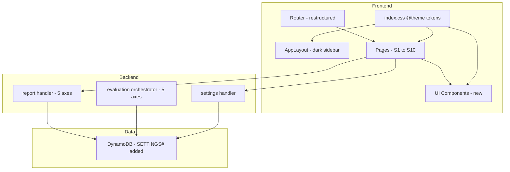

# Design Document — Chorus デザイン・実装監査 差分台帳（実装）

## Overview

**Purpose**: Pencil デザイン（`design/pencil-new.pen`）に基づき、Chorus 全画面をダークテーマへ移行し、ルーティング再編・画面統合・新規コンポーネント追加・データモデル拡張を実施する。
**Users**: Chorus を利用するデザイナー・プロダクトチームが、統一されたダーク UI でペルソナ管理・A/B テスト・結果分析を行う。
**Impact**: インラインスタイル 430 箇所を Tailwind トークンへ移行、ルート 5 件を廃止/統合、新規コンポーネント 10 種以上を追加、EvaluationScores を 4→5 軸に拡張、設定 API を新設。

### Goals
- 全画面をダークテーマトークンで統一する
- 差分台帳 P0〜P7 の優先順序に沿って段階的に実装する
- 既存データとの後方互換を維持する

### Non-Goals
- Pencil デザインファイルの変更
- CDK / Cognito インフラ変更
- E2E テスト自動化基盤の構築
- ライトテーマの維持（ダーク専用に移行）

## Boundary Commitments

### This Spec Owns
- Tailwind トークン基盤（`index.css` `@theme` ブロック）
- 全画面のダーク化とインラインスタイル → Tailwind ユーティリティ移行
- ルーティング再編（廃止・統合・リダイレクト）
- 新規 UI コンポーネント群（PersonaNode, FieldSlider, SegmentControl, ChatBubble, LedgerRow, Modal, RadarChart, AttributeHeatmap, HelpDot, Popover 群）
- S6 統合ペルソナ画面、S9 設定モーダル、S2 結果レポート拡張、S4+S5 テスト作成フロー統合、S8 テスト一覧改修
- EvaluationScores 5 軸化（フロント・バックエンド両方）
- 設定 API（`GET/PUT /api/settings`）

### Out of Boundary
- `design/pencil-new.pen` の変更
- CDK スタック・Cognito 設定の変更
- 既存テストデータのマイグレーション（`trust` は undefined → 0 フォールバック）

### Allowed Dependencies
- `design/pencil-new.pen` の現在の状態をデザインの正とする
- 既存の DynamoDB シングルテーブル設計を拡張する
- 既存の `apiRequest<T>()` / `apiStream()` パターンを踏襲する

### Revalidation Triggers
- `pencil-new.pen` のデザイン変更
- EvaluationScores インターフェースの変更
- 設定 API のスキーマ変更

## Architecture

### Existing Architecture Analysis

現行は React 19 SPA（Vite + Tailwind v4）+ Hono バックエンド（Lambda/ローカル兼用）+ DynamoDB シングルテーブル。以下の制約を維持する:

- **状態管理**: `useState` / `useEffect` のみ（グローバル状態管理なし）
- **API 通信**: `apiRequest<T>()` 経由
- **DynamoDB**: `PK/SK` パターンのシングルテーブル設計
- **型共有**: フロントエンド・バックエンドで型を重複定義（パッケージ間共有なし）

### Architecture Pattern & Boundary Map



**Architecture Integration**:
- **Selected pattern**: 既存のページ中心 + ドメイン分割パターンを維持
- **Domain boundaries**: フロントエンドは画面単位、バックエンドはドメイン単位で分割
- **New components rationale**: デザインシステムの共通化（`components/ui/`）と、レポート専用コンポーネント（RadarChart, AttributeHeatmap）
- **Steering compliance**: 脱・箱ルール、発光制限、4/8 グリッドスナップを遵守

### Technology Stack

| Layer | Choice / Version | Role in Feature | Notes |
|-------|------------------|-----------------|-------|
| Frontend | React 19 + Tailwind CSS v4 | `@theme` トークン基盤 + ユーティリティ移行 | `@theme` ブロックで CSS 変数定義 |
| Frontend | React Router v6 | ルーティング再編 | リダイレクト・ルート廃止 |
| Frontend | Lucide React | アイコン | 既存継続 |
| Backend | Hono | 設定 API エンドポイント | `GET/PUT /api/settings` |
| Data | DynamoDB | 設定永続化 | `SETTINGS#` SK プレフィックス追加 |
| AI | Amazon Bedrock | 5 軸評価プロンプト | `trust` 軸を追加 |

## File Structure Plan

### Directory Structure

```
packages/frontend/src/
├── index.css                    # @theme ブロック追加
├── router.tsx                   # ルート再編
├── components/
│   ├── AppLayout.tsx            # ダーク化 + ナビ変更 + 設定モーダル統合
│   ├── ui/                      # 新規 UI プリミティブ
│   │   ├── Button.tsx
│   │   ├── Modal.tsx
│   │   ├── FieldText.tsx
│   │   ├── FieldSelect.tsx
│   │   ├── FieldSlider.tsx
│   │   ├── SegmentControl.tsx
│   │   ├── FormField.tsx
│   │   └── ChatBubble.tsx
│   ├── persona/
│   │   ├── PersonaNode.tsx      # 新規: identicon アバター
│   │   └── PersonaCard.tsx      # 改修: ダーク + PersonaNode 使用
│   ├── report/                  # 新規ディレクトリ
│   │   ├── RadarChart.tsx
│   │   ├── AttributeHeatmap.tsx
│   │   ├── HelpDot.tsx
│   │   ├── MethodPopover.tsx
│   │   ├── SourcePopover.tsx
│   │   └── AttributePopover.tsx
│   ├── test/                    # 新規ディレクトリ
│   │   └── LedgerRow.tsx        # 新規: S8 テスト一覧行
├── pages/
│   ├── PersonaUnifiedPage.tsx   # 新規: S6 統合画面
│   └── (既存ページ群)           # ダーク化
├── components/
│   ├── settings/
│   │   └── SettingsModal.tsx    # 新規: S9 モーダル（ページではなくモーダル）
└── types/
    └── index.ts                 # EvaluationScores trust 追加

packages/backend/src/
├── settings/
│   └── handler.ts               # 新規: GET/PUT /api/settings
├── shared/
│   └── types.ts                 # EvaluationScores trust 追加
├── evaluation/
│   └── orchestrator.ts          # trust 軸プロンプト追加
└── report/
    └── handler.ts               # avgScores に trust 追加
```

### Modified Files

- `index.css` — `@theme` ブロックでダークトークン定義を追加
- `router.tsx` — ルート廃止（5 件）、統合、リダイレクト追加
- `AppLayout.tsx` — ダーク化、ナビ項目変更、設定モーダル開閉管理
- `PersonaCard.tsx` — ダーク化、PersonaNode 使用
- `TestReportPage.tsx` — 5 軸表示、DonutChart 廃止、新コンポーネント統合
- `TestInputPage.tsx` — ペルソナ選択モーダル統合、確認ページ統合
- `TestListPage.tsx` — LedgerRow 使用、ABTestTable 廃止
- `PersonaListPage.tsx` — ダーク化
- `TestRunningPage.tsx` — ダーク化
- `dev-server.ts` — 設定 API ルート追加、5 軸スタブ対応
- `types/index.ts` — `EvaluationScores` に `trust` 追加
- `shared/types.ts` — `EvaluationScores` に `trust` 追加
- `evaluation/orchestrator.ts` — 評価プロンプトに trust 軸追加
- `report/handler.ts` — avgScores 集計に trust 追加

## Requirements Traceability

| Requirement | Summary | Components | Interfaces |
|-------------|---------|------------|------------|
| 1.1〜1.4 | Tailwind トークン基盤 | index.css @theme | CSS カスタムプロパティ |
| 2.1〜2.6 | AppLayout ダーク化 + ルーティング | AppLayout, router.tsx | NavItem 変更, リダイレクト |
| 3.1〜3.8 | S6 統合ペルソナ画面 | PersonaUnifiedPage, PersonaNode, FieldSlider, SegmentControl, ChatBubble | タブ切替, フォーム入力, プロンプトプレビュー |
| 4.1〜4.5 | S9 設定モーダル | SettingsModal, Modal | Settings API (GET/PUT) |
| 5.1〜5.7 | S2 結果レポート拡張 | RadarChart, AttributeHeatmap, HelpDot, Popover 群 | EvaluationScores 5 軸 |
| 6.1〜6.4 | S4+S5 テスト作成フロー | TestInputPage (改修), Modal | ペルソナ選択モーダル |
| 7.1〜7.4 | S8 テスト一覧改修 | LedgerRow | 行選択ハイライト |
| 8.1〜8.3 | 残画面ダーク化 | PersonaListPage, TestRunningPage, AboutModal | トークンユーティリティ |

## Components and Interfaces

| Component | Domain/Layer | Intent | Req Coverage | Key Dependencies | Contracts |
|-----------|--------------|--------|--------------|------------------|-----------|
| @theme tokens | UI/Foundation | ダークカラー・フォント・spacing 定義 | 1.1〜1.4 | なし | CSS |
| AppLayout | UI/Shell | ダーク Sidebar + ナビ + モーダル管理 | 2.1〜2.6 | @theme tokens (P0) | State |
| PersonaNode | UI/Persona | seed ベース identicon アバター | 3.7 | なし | — |
| PersonaUnifiedPage | UI/Page | 編集+インタビュー統合画面 | 3.1〜3.8 | @theme tokens (P0); PersonaNode, FieldSlider, SegmentControl, ChatBubble は同フェーズ(P2) | State |
| SettingsModal | UI/Settings | 4 セクション設定モーダル + ドリルインナビ | 4.1〜4.4 | @theme tokens (P0), Modal (P0), Settings API (P0) | API, State |
| Settings API | Backend/Settings | ユーザー設定 CRUD | 4.5 | DynamoDB (P0) | API |
| RadarChart | UI/Report | 5 軸レーダーチャート (SVG) | 5.4 | なし | — |
| AttributeHeatmap | UI/Report | 属性別勝率ヒートマップ | 5.5 | SegmentControl (P1) | — |
| HelpDot + Popovers | UI/Report | 評価手法説明ポップオーバー | 5.6 | なし | — |
| LedgerRow | UI/Test | テスト一覧行 | 7.1〜7.4 | @theme tokens (P0) | — |
| Modal | UI/Shared | 汎用モーダルオーバーレイ | 4.1, 6.2 | @theme tokens (P0) | — |
| FieldSlider | UI/Form | カスタムスライダー | 3.4 | @theme tokens (P0) | — |
| SegmentControl | UI/Form | セグメント切替 | 3.4 | @theme tokens (P0) | — |
| ChatBubble | UI/Chat | チャットバブル | 3.6 | @theme tokens (P0) | — |

### Backend / Settings

#### Settings API

| Field | Detail |
|-------|--------|
| Intent | ユーザー設定の取得・更新 |
| Requirements | 4.5 |

**Responsibilities & Constraints**
- ユーザー単位の設定データ（Figma 連携、AI モデル、プロンプト追加指示）を DynamoDB に永続化
- `PK: USER#<userId>, SK: SETTINGS#<section>` パターン

### UI / Settings

#### SettingsModal

| Field | Detail |
|-------|--------|
| Intent | 4 セクション設定モーダル + プロンプト詳細ドリルイン |
| Requirements | 4.1〜4.4 |

**Implementation Notes**
- モーダル内部の状態で「一覧ビュー」と「プロンプト詳細ビュー」を切り替え（モーダル on モーダルではない）
- プロンプト詳細ビューは戻る矢印でコンテンツを差し替えるドリルイン方式
- プロンプト詳細の 3 区分: 「固定コンテキスト」（読み取り専用）、「固定指示」（読み取り専用）、「追加指示」（編集可能テキストエリア）

```typescript
interface SettingsModalProps {
  open: boolean;
  onClose: () => void;
}

type SettingsView =
  | { kind: "sections" }
  | { kind: "prompt-detail"; templateId: string };
```

**Dependencies**
- Outbound: DynamoDB — 設定レコード読み書き (P0)

**Contracts**: API [x]

##### API Contract

| Method | Endpoint | Request | Response | Errors |
|--------|----------|---------|----------|--------|
| GET | `/api/settings` | — | `UserSettings` | 401 |
| PUT | `/api/settings` | `UpdateSettingsInput` | `UserSettings` | 400, 401 |

```typescript
interface UserSettings {
  figma?: { token: string; email?: string };
  model?: { modelId: string };
  prompts?: Record<string, { additionalInstructions: string }>;
}

interface UpdateSettingsInput {
  section: "figma" | "model" | "prompts";
  data: unknown;
}
```

### UI / Foundation

#### @theme Tokens

| Field | Detail |
|-------|--------|
| Intent | ダークテーマの CSS カスタムプロパティ定義 |
| Requirements | 1.1, 1.2, 1.3, 1.4 |

**Implementation Notes**
- `index.css` の `@theme` ブロックに全トークンを定義
- 既存の `@import "tailwindcss"` と `@keyframes` は維持
- カラートークンは `--color-` プレフィックス、spacing は `--spacing-` プレフィックス

```css
/* index.css @theme ブロック構造 — 値は design/pencil-new.pen の get_variables から取得 */
@theme {
  /* カラー */
  --color-bg-base: #0A0B0D;
  --color-bg-surface: #131517;
  --color-bg-raised: #1C1F23;
  --color-hairline: #FFFFFF14;
  --color-text-hi: #F2F4F7;
  --color-text-mid: #9BA1AC;
  --color-text-lo: #5B616B;
  --color-accent: #6E78D9;
  --color-accent-dim: #6E78D926;
  --color-win-a: #6E78D9;
  --color-win-b: #C9974F;
  --color-danger: #E06A6A;
  --color-success: #54B587;
  --color-draw: #3A3D42;

  /* フォント */
  --font-sans: 'Geist', sans-serif;
  --font-mono: 'Geist Mono', monospace;

  /* spacing */
  --spacing-1: 4px;
  --spacing-2: 8px;
  --spacing-3: 12px;
  --spacing-4: 16px;
  --spacing-5: 24px;
  --spacing-6: 32px;
  --spacing-7: 48px;

  /* 角丸 */
  --radius-sm: 6px;
  --radius-md: 10px;
  --radius-lg: 14px;

  /* タイポグラフィサイズ */
  --text-xs: 11px;
  --text-sm: 13px;
  --text-base: 14px;
  --text-lg: 18px;
  --text-xl: 24px;
  --text-display: 40px;
}
```

### UI / Report

#### DesignCard（改修）

| Field | Detail |
|-------|--------|
| Intent | 比較デザイン画像の表示。脱箱ルールに従い装飾を最小化 |
| Requirements | 5.7 |

**Implementation Notes**
- 勝者 A 側: 左 2px のアクセントバー（`$win-a`）のみ。全周ボーダー・Trophy バッジは廃止
- B 側: 枠・fill・装飾なし。`bg-base` に直置き（完全に脱箱）
- 勝者が B の場合は B 側にアクセントバー（`$win-b`）、A 側が装飾なし
- DRAW の場合は両方装飾なし

#### RadarChart

| Field | Detail |
|-------|--------|
| Intent | 5 軸（usability, aesthetics, clarity, engagement, trust）のレーダーチャートを SVG で描画 |
| Requirements | 5.4 |

```typescript
interface RadarChartProps {
  scoresA: EvaluationScores;
  scoresB: EvaluationScores;
  size?: number;
}
```

**Implementation Notes**
- 外部ライブラリ不使用。SVG path + polygon で描画
- 5 軸の頂点座標は `cos/sin` で計算。`design/radar.js` を参考にする
- A/B 両方のポリゴンを重ねて表示。A は `$accent`、B は `$win-b`

#### AttributeHeatmap

| Field | Detail |
|-------|--------|
| Intent | ペルソナ属性（タイプ/性別/年齢層）× 評価軸のクロス集計ヒートマップ |
| Requirements | 5.5 |

```typescript
interface AttributeHeatmapProps {
  evaluations: EvaluationResult[];
  personas: Persona[];
  groupBy: "type" | "gender" | "ageGroup";
}
```

**Implementation Notes**
- セルの値は A 勝率（%）。A/B トグル（SegmentControl）で視点切替
- フロントエンドで `evaluations` + `personas` データから算出（API 新設なし）
- 色の濃淡で勝率の高低を表現

### UI / Form (共通)

FieldSlider, SegmentControl, ChatBubble, FormField は同一の基本パターンに従う:

```typescript
interface BaseFormProps {
  label?: string;
  disabled?: boolean;
}

interface FieldSliderProps extends BaseFormProps {
  value: number;
  min: number;
  max: number;
  step?: number;
  onChange: (value: number) => void;
}

interface SegmentControlProps<T extends string> extends BaseFormProps {
  options: Array<{ value: T; label: string }>;
  selected: T;
  onChange: (value: T) => void;
}

interface ChatBubbleProps {
  role: "user" | "assistant";
  content: string;
}
```

### UI / Persona

#### PersonaUnifiedPage — プロンプトプレビュー

| Field | Detail |
|-------|--------|
| Intent | 編集タブで合成プロンプトの全文を折りたたみ式で確認できる |
| Requirements | 3.8 |

**Implementation Notes**
- 編集タブのフォーム下部に折りたたみ式（`<details>` or 状態管理）で合成プロンプトプレビューを配置
- 現在のペルソナ設定（名前、年齢、性別、タイプ、偏差値等）から動的に生成されるプロンプト全文を表示
- 読み取り専用。`font-mono` + `text-sm` で表示

```typescript
interface PromptPreviewProps {
  persona: Persona;
  collapsed?: boolean;
}
```

## Data Models

### EvaluationScores 5 軸化

```typescript
// フロントエンド: packages/frontend/src/types/index.ts
// バックエンド: packages/backend/src/shared/types.ts
interface EvaluationScores {
  usability: number;
  aesthetics: number;
  clarity: number;
  engagement: number;
  trust: number;  // 新規
}
```

**後方互換**: 既存データの `trust` は `undefined`。表示時は `trust ?? 0` でフォールバック。avgScores 集計では trust 値が存在するレコードのみで平均を算出。

### Settings レコード（DynamoDB）

| PK | SK | 属性 |
|----|-----|------|
| `USER#<userId>` | `SETTINGS#figma` | `{ token: string, email?: string }` |
| `USER#<userId>` | `SETTINGS#model` | `{ modelId: string }` |
| `USER#<userId>` | `SETTINGS#prompt#<templateId>` | `{ additionalInstructions: string }` |

既存の `userKey()`, `personaKey()` 等と同じパターンで `settingsKey()` を追加:

```typescript
function settingsKey(userId: string, section: string) {
  return { PK: `USER#${userId}`, SK: `SETTINGS#${section}` } as const;
}
```

## Error Handling

### Error Strategy
- 設定 API: 既存の `apiRequest` エラーハンドリングパターン（`ApiError` + `getApiErrorMessage`）を踏襲
- 5 軸フォールバック: `trust` が `undefined` の場合は UI で N/A 表示、集計から除外

### Error Categories
- **400**: 設定更新時の不正入力（section 名が無効等）
- **401**: 認証エラー（既存パターン）
- **後方互換エラー**: 既存 4 軸データは正常表示を保証

## Testing Strategy

### Unit Tests
- `@theme` トークン: Tailwind ユーティリティクラスが正しく生成されることを確認
- `RadarChart`: 5 軸の SVG path が正しい座標を生成することを確認
- `AttributeHeatmap`: 勝率計算ロジックの正確性
- `settingsKey()`: DynamoDB キー生成の型安全性
- `EvaluationScores` 5 軸: avgScores 集計に trust が含まれることを確認

### Integration Tests
- ルーティング再編: `/` → `/personas` リダイレクト、廃止ルートが 404 を返すこと
- 設定 API: `GET/PUT /api/settings` の CRUD フロー
- S6 ペルソナ画面: タブ切替 + データ永続化

### E2E Tests（手動）
- 全画面のダークテーマ表示確認
- テスト作成フロー: S4 → S5 モーダル → 実行
- 結果レポート: 5 軸 RadarChart + AttributeHeatmap 表示
