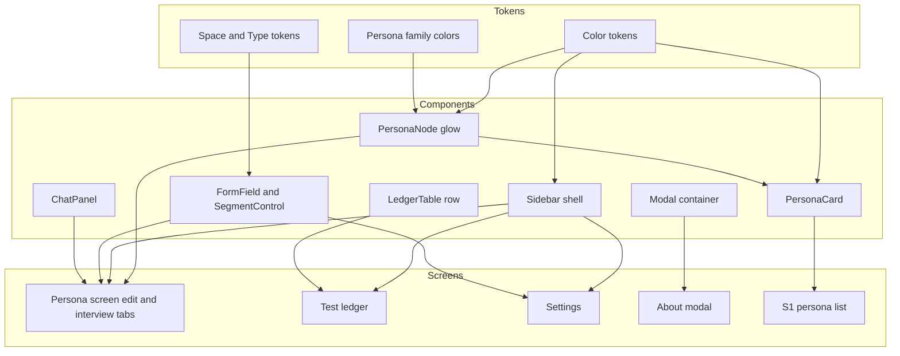
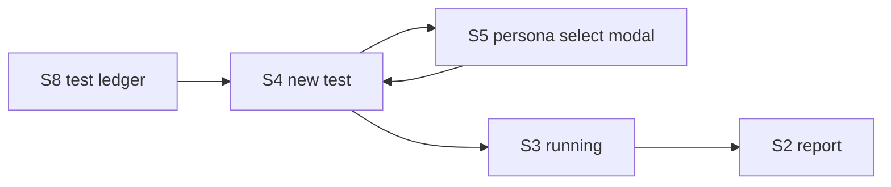

# Technical Design: chorus-pencil-screens

## Overview

本設計は、A/Bテストプラットフォーム **Chorus** の未設計画面群を、Linear/Stripe 系ダーク世界観で **Pencil（`design/pencil-new.pen`）** 上に構築するためのものである。成果物は実装コードではなく **Pencil デザイン**（reusable component と screen frame）であり、「システム」は Chorus UI デザインを指す。

対象ユーザーは Chorus を使うデザイナー／プロダクトチーム。本設計が定める画面（ペルソナ画面〔編集タブ＋インタビュータブの統合〕・テスト一覧・設定・About）を通じて、ペルソナ定義からインタビュー、テスト管理までを一貫した世界観で操作できる。ペルソナの作成/編集とインタビューは別画面ではなく、1つの統合ペルソナ画面のタブとして提供する。

本設計は既存の `pencil-new.pen`（S1〜S5、確定トークン、`PersonaNode`/`PersonaCard`）を基盤として拡張する。新トークンは最小限に留め、共通シェル（サイドバー）を reusable component 化して全画面の nav を統一する。

### Goals
- 未設計の画面群（統合ペルソナ画面〔編集タブ＋インタビュータブ〕・テスト一覧・設定・About）をダーク世界観で設計する。ペルソナの作成/編集と詳細+インタビューは1画面に統合し、インタビューはタブとして表現する。
- 既存 S2 結果レポート画面を拡張し、5軸レーダー（`radar.js`・1〜5採点の全ペルソナ平均/最大5固定・凡例は見出し直下に左寄せ）・支持率 hero（多数決）・軸別詳細・支持理由のまとめ・ペルソナ別評価台帳（LedgerRow 流用）・出所メタデータのオンデマンド開示（「?」（HelpDot）二層化＝集約見出しの「?」ホバー開示／行クリック詳細）＋エクスポートに全メタデータを加える。
- 既存 S1〜S5 を含む全画面で脱・箱規律・発光規律・トークンを統一する。
- 共通サイドバーを reusable 化し、nav を「ペルソナ / A/Bテスト / 結果」の3項目に統一する。設定は nav に置かず、アカウント（アバター）クリックで開くポップオーバー `AccountMenu`（設定 / Chorus について / サインアウト）へ移す。
- S1 ペルソナ一覧に属性脚注を追加する。S6 編集タブにプロンプトプレビューを、S9 設定に「既定モデル」を加える（S2 への波及項目）。

### Non-Goals
- 実装コード（React/バックエンド）の変更。
- ダッシュボード画面、独立ペルソナ選択ページ、確認画面、サインイン画面の設計（Req 10）。
- 新規データ項目・API・データスキーマの実装（バックエンドは別途）。S2 拡張の新規メタデータ（5軸目の信頼感、ペルソナ合成プロンプト、評価軸プロンプト、使用モデル）はデザイン上の表示枠の用意のみを行う。
- テスト単位の使用モデル選択UIの設計（使用モデルは S9 設定の「既定モデル」に集約）。

## Boundary Commitments

### This Spec Owns
- `pencil-new.pen` 内の新規 screen frame: ペルソナ画面（編集タブ・インタビュータブの2アートボードで統合表現）、テスト一覧、設定、About モーダル。
- 既存 S2 結果レポート画面の拡張（5軸レーダー・支持率 hero・軸別詳細・支持理由のまとめ・ペルソナ別評価台帳・出所メタデータのオンデマンド開示〔「?」（HelpDot）二層化＝集約見出しの「?」ホバー開示／行クリック詳細〕とエクスポートの追加）。
- 新規 reusable component: `Sidebar`（共通シェル）、`FormField`/`SegmentControl` 等の入力プリミティブ、`ChatPanel`、`LedgerTable` 行、`Modal` 容器、S2 出所開示の浮遊ポップオーバー `AttributePopover`/`SourcePopover`/`MethodPopover`、ヘルプ/出所の合図となる `HelpDot`（丸枠＋?）。新規 `script` ノード `radar.js`（5軸レーダー）。
- S6 編集タブへのプロンプトプレビュー表示枠の追加、S9 設定への「既定モデル」設定項目の追加。
- 既存 S1 ペルソナカードへの属性脚注の追加、既存 S1〜S5 サイドバーの instance 置換。

### Out of Boundary
- 実装コード・API・データスキーマの変更。
- スコープ外画面（Req 10）。
- `identicon.js` のアルゴリズム変更（既存スクリプトをそのまま使用）。

### Allowed Dependencies
- 既存トークン（`bg-*`, `text-*`, `accent`, `win-a/b`, `space-*`, `text-*`, `p-*`, `r-*`）。
- 既存 reusable component `PersonaNode`(CtjwC)、`PersonaCard`(MrWyv)。
- 新規 `script` ノード `radar.js`（S2 の5軸レーダーチャートを A vs B 重ね描画。Pencil の `script` ノードで実装）。`identicon.js` と同様、`script` ノードの一種として `pencil-new.pen` 内に置く。
- 情報設計の参照元として現行 React アプリ（`packages/frontend`）と型定義（変更しない）。S2 拡張は `ReportResponse`/`ReportSummary`/`EvaluationResult`/`EvaluationScores` を参照する。

### Revalidation Triggers
- トークン名・値の変更（全画面に波及）。
- `Sidebar` の nav 構成・override slot の変更。
- `PersonaCard` / `PersonaNode` の構造変更（一覧・作成・詳細に波及）。
- 現行型（`Persona`/`ABTest`/`ConversationMessage`）のフィールド増減（表示項目に波及）。
- `EvaluationScores` の軸数変更（4→5軸。S2 レーダー・軸別詳細に波及）、`radar.js` の入出力契約の変更（S2 レーダー描画に波及）。

## Architecture

### Existing Architecture Analysis
- `pencil-new.pen` は **variables（トークン）→ reusable components → screen frames** の3層で構成されている。
- 既存トークンと `PersonaNode`/`PersonaCard` は確定済みで、本設計はこれを再利用する。
- 現状の課題: サイドバーが各画面に**複製**されており（reusable 化されていない）、nav 変更が全画面手作業になる。本設計で `Sidebar` を component 化して解消する。

### Design System Layering & Dependency

依存方向は **Tokens → Components → Screens** の一方向。上位（Screens）は下位（Tokens）を参照するが逆流しない。



**Architecture Integration**:
- Selected pattern: トークン基盤のデザインシステム階層（既存踏襲）。
- Boundaries: コンポーネントは単一責務（識別=PersonaNode、人格カード=PersonaCard、入力=FormField 等）。画面はそれらの instance 配置に徹する。
- Existing patterns preserved: 脱・箱（bg-base 直置き + hairline + タイポ階層）、発光は人格のみ、台帳テーブル。
- New components rationale: `Sidebar`（nav 統一）、`FormField`/`SegmentControl`（ペルソナ画面の編集タブ・設定で再利用）、`ChatBubble`（ペルソナ画面のインタビュータブ。タブはインラインで実現し新規コンポーネントは増やさない）、`LedgerRow`（一覧）、`Modal`（About + 既存S5の容器共通化）。
- Steering compliance: `CLAUDE.md` Design Policy（脱・箱、発光規律、4/8トークン、自己批評）。

### Design Token Stack

| Layer | Choice / Version | Role in Feature | Notes |
|-------|------------------|-----------------|-------|
| デザインツール | Pencil（`.pen` v2.14） | 全画面・コンポーネントの設計媒体 | `pencil-new.pen` が正本 |
| カラートークン | bg-base/surface/raised, text-hi/mid/lo, accent=`#6E78D9`, win-b=`#C9974F` | 無彩3階層 + 単一アクセント | 既存。新規追加なし |
| スペース/タイポ | `space-1..7`(4/8), `text-xs..display` | レイアウトのグリッドスナップ | 既存。全新画面で参照 |
| ペルソナ色 | `p-haruto..p-rina` + `p-yoshiko/p-takuya/p-nao` | 人格の発光識別 | 既存9色。作成画面は seed から動的生成 |
| アバター生成 | `identicon.js`（決定論, seed=表示名） | 発光アバターのプレビュー | 既存スクリプト。変更しない |

## File Structure Plan

`pencil-new.pen` 単一ファイル内のノード構成（物理ファイルは増えない）。

### Node Structure（document 直下）
```
pencil-new.pen (document)
├── [reusable] Sidebar            # 新規: 共通シェル(brand/nav/account) ※navは3項目+折りたたみトグル
├── [reusable] SidebarCollapsed   # 新規: 折りたたみ状態(幅56/アイコンのみ/展開トグル)
├── [reusable] AccountMenu        # 新規: アカウントのポップオーバー(設定/About/サインアウト)
├── [reusable] PersonaNode        # 既存(CtjwC)
├── [reusable] PersonaCard        # 既存(MrWyv) ※属性脚注を拡張
├── [reusable] FormField          # 新規: ラベル+入力slot
├── [reusable] FieldText          # 新規: テキスト入力(masked対応)
├── [reusable] FieldSelect        # 新規: セレクト入力
├── [reusable] FieldSlider        # 新規: スライダー入力
├── [reusable] SegmentControl     # 新規: セグメント選択(性別/入力方式)
├── [reusable] ChatBubble         # 新規: インタビュー発話(user/persona)
├── [reusable] Modal              # 新規: オーバーレイ+パネル容器
├── [reusable] HelpDot            # 新規: 丸枠+? のヘルプ/出所合図(ホバーで対応ポップオーバー表示)。lucideにヘルプ系アイコンが無いため自作
├── [reusable] AttributePopover   # 新規: S2 人格クリック=属性のみ
├── [reusable] SourcePopover      # 新規: S2 行クリック=モデル/解決済みプロンプト/コメント/5軸スコア
├── [reusable] MethodPopover      # 新規: S2 集約見出しの「?」=生成元+レーダー算出方法
├── [script]   radar.js           # 新規: 5軸レーダーチャート(A vs B 重ね描画)
├── S1 ペルソナ管理 (JAyqO)        # 既存 ※属性追加 + Sidebar instance化
├── S2 結果レポート (KDgO1)        # 既存 ※大幅拡張: ヘッダーメタ(+エクスポート導線)/支持率hero/比較プレビュー/radar.js(5軸)/軸別詳細/支持理由まとめ/ペルソナ別評価台帳(LedgerRow流用)/出所メタデータのオンデマンド開示(「?」HelpDot・行クリック)＋エクスポート + Sidebar instance化
├── S3 実行中 (OSMxe)             # 既存 ※Sidebar instance化
├── S4 新規テスト (AnX1d)          # 既存 ※Sidebar instance化
├── S5 ペルソナ選択モーダル (o3pQ3) # 既存 ※Modal component化(任意)
├── S6 ペルソナ(編集タブ)          # 新規: 統合ペルソナ画面の「編集」タブ状態。右に人格ヒーロー常時表示
├── S6 ペルソナ(インタビュータブ)   # 新規: 同一画面の「インタビュー」タブ状態(別アートボードで表現)。旧S7は本画面のタブへ統合
├── S8 テスト一覧                  # 新規
├── S9 設定                       # 新規
└── S10 About モーダル            # 新規
```

### Modified Nodes
- `PersonaCard`(MrWyv) — 属性脚注を年齢/性別/職業に加え必要に応じ拡張（Req 4）。既存インスタンスに波及するため変更は加点的に行う。
- `S2 結果レポート`(KDgO1) — サイドバー置換に加え、ヘッダーメタ（＋エクスポート導線）・支持率 hero（多数決）・比較プレビュー・5軸レーダー（`radar.js`・1〜5平均/最大5固定・凡例は見出し直下に左寄せ）・軸別詳細・支持理由のまとめ・ペルソナ別評価台帳（LedgerRow 流用）・出所メタデータのオンデマンド開示（「?」（HelpDot）二層化＝集約見出しの「?」ホバーで `MethodPopover`／行クリックの `SourcePopover`／人格クリックの `AttributePopover`）＋エクスポートに全メタデータを加える大幅拡張（Req 11）。脱・箱規律を保ち、レーダー／比較画像／データ表など独立オブジェクトのみ枠を許容する。
- `S6 ペルソナ(編集タブ)` — 属性＋自由記述から合成される「プロンプトプレビュー」の表示枠／導線を追加（Req 5.7）。
- `S9 設定` — Figma 連携に加え「既定モデル」の設定項目を追加。レポート（S2）の使用モデル名の源流（Req 8.5, 11.12）。
- `S1〜S4` のサイドバー — 複製ノードを `Sidebar` instance に置換し、nav ラベルを「A/Bテスト/結果」に統一、ダッシュボード項目を除外（Req 3, 10.1）。

## System Flows

テスト作成フローのナビゲーション（Req 10.2/10.3 のスコープ反映）。確認専用画面と独立選択ページは存在せず、S4 内で完結する。



- S4 の「変更」から S5 モーダルを開き、選択後 S4 に戻る（独立ページなし）。
- S4 の「作成して実行」で直接 S3 実行中へ（確認画面なし）。

## Requirements Traceability

| Requirement | Summary | Components | Flows |
|-------------|---------|------------|-------|
| 1.1–1.6 | 世界観・脱箱規律 | 全 components / screens | — |
| 2.1–2.4 | トークン準拠 | Token stack 全体 | — |
| 3.1–3.5 | nav 統一(3項目) + AccountMenu | Sidebar, AccountMenu | — |
| 4.1–4.4 | S1 属性追加 | PersonaCard, S1 | — |
| 5.1–5.7 | ペルソナ画面 編集タブ（5.7=プロンプトプレビュー） | S6(編集タブ), FormField, SegmentControl, PersonaNode | — |
| 6.1–6.5 | ペルソナ画面 インタビュータブ + タブ切替 | S6(インタビュータブ), ChatBubble, PersonaNode | — |
| 7.1–7.5 | テスト一覧 | S8, LedgerRow | テスト作成フロー |
| 8.1–8.5 | 設定（8.5=既定モデル） | S9, FormField | — |
| 9.1–9.3 | About | S10, Modal | — |
| 10.1–10.4 | スコープ外非作成 | （設計しないことの確認） | テスト作成フロー |
| 11.1–11.19 | S2 結果レポートの拡張（5軸レーダー〔1〜5平均/最大5固定・凡例は見出し直下に左寄せ〕・支持率〔多数決〕・軸別・支持理由・ペルソナ別台帳・「?」（HelpDot）二層化のオンデマンド開示＋エクスポート） | S2, radar.js, LedgerRow, AttributePopover, SourcePopover, MethodPopover, HelpDot, S9(既定モデル) | テスト作成フロー |

## Components and Interfaces

各「contract」は Pencil コンポーネントの **override slot**（instance 配置時に差し替える descendant プロパティ）を TypeScript 風に表現する。これは実装コードではなく、デザインの再利用契約である。

| Component | Layer | Intent | Req Coverage | Key Dependencies | Contracts |
|-----------|-------|--------|--------------|------------------|-----------|
| Sidebar | Shell | 共通の brand/nav(3項目)/account | 3 | Color tokens (P0) | State(active nav) |
| AccountMenu | Shell | アカウントのポップオーバー(設定/About/サインアウト) | 3,8,9 | Color tokens (P0) | State(account) |
| PersonaNode | Identity | 発光identicon識別タイル | 1,2,5,6 | p-* tokens, identicon.js (P0) | State(seed,color) |
| PersonaCard | Identity | 人格ヒーロー+属性脚注 | 4 | PersonaNode (P0) | State(persona) |
| FormField | Input | ラベル+入力slot | 5,8 | space/text tokens (P0) | State(value) |
| FieldText/Select/Slider | Input | slotに差す入力プリミティブ | 5,8 | space tokens (P1) | State(value) |
| SegmentControl | Input | 排他選択(性別/入力方式) | 5 | space tokens (P1) | State(selected) |
| ChatBubble | Interview | 発話(user/persona) | 6 | p-* tokens (P1) | State(role,content) |
| LedgerRow | Data | テスト一覧の台帳行 / S2 ペルソナ別評価行 | 7,11 | hairline token (P1) | State(abtest / evaluation) |
| Modal | Overlay | オーバーレイ+パネル容器 | 9 | bg/hairline tokens (P1) | State(open) |
| AttributePopover | Overlay | S2 人格クリック=属性のみ(モデル/プロンプトは出さない) | 11 | bg/hairline tokens (P1) | State(persona) |
| SourcePopover | Overlay | S2 ペルソナ別台帳の行クリック詳細(使用モデル/解決済みプロンプト/コメント/5軸スコア) | 11 | bg/hairline tokens (P1) | State(evaluation) |
| MethodPopover | Overlay | S2 集約見出しの「?」ホバー=生成元(モデル/プロンプト)+レーダーの算出方法(1〜5平均/最大5固定) | 11 | bg/hairline tokens (P1) | State(method) |
| HelpDot | Overlay | ヘルプ/出所の合図(丸枠＋?)。集約見出しに置き、ホバーで対応ポップオーバーを開く | 11 | text/hairline tokens (P1) | State(target) |
| RadarChart (radar.js) | Viz | S2 の5軸レーダー(A vs B 重ね描画・1〜5平均/最大5固定・凡例は見出し直下に左寄せ) | 11 | win-a/b tokens, script node (P1) | Input(avgScores A/B) |

### Shell

#### Sidebar
| Field | Detail |
|-------|--------|
| Intent | 全画面共通のサイドバー（brand / nav / account） |
| Requirements | 3.1, 3.2, 3.3, 3.4 |

**Responsibilities & Constraints**
- nav 項目を「ペルソナ / A/Bテスト / 結果」の3項目に固定し、ダッシュボードを含めない（3.2, 10.1）。設定は nav から外し、account（アバター）クリックの `AccountMenu` ポップオーバーへ移す（3.4, 3.5）。
- アクティブ項目を accent でハイライト（3.3）。檻側なので発光は付けない（1.5）。
- account 行はアバター・名前・ロール・展開シェブロンで構成し、メニューの起点であることを示す（3.4）。
- ブランド行右端に折りたたみトグル（`panel-left-close`）を置く。折りたたみ状態は別 component `SidebarCollapsed`（幅56・アイコンのみ・`panel-left` の展開トグル・アバターのみ）として定義する。現行 React `AppLayout.tsx` の collapsed 挙動を参照元とする。

**Dependencies**
- Outbound: Color tokens — 配色（P0）

**Contracts**: State ✔

##### State Management（override slots）
```typescript
type NavKey = "personas" | "abtest" | "results";
interface SidebarOverride {
  activeNav: NavKey;        // アクティブ項目を1つ指定
  account: { initials: string; name: string; role: string };
}
```
- Invariants: nav は常に3項目・順序固定（設定を含めない）。`activeNav` は3キーのいずれか。

**Implementation Notes**
- Integration: 既存 S1〜S4 のサイドバー複製を本 instance へ置換。**この移行は独立タスクとして切り出し**、置換後に4画面（S1〜S4）のスクショ自己批評で nav 統一（3項目・ダッシュ無し・正しいアクティブ）が崩れていないことを**完了条件**とする。
- Risks: 置換漏れ・nav ラベルのドリフト。→ 移行タスクの完了条件（上記）で担保。

#### AccountMenu
| Field | Detail |
|-------|--------|
| Intent | アカウント（アバター）クリックで開くポップオーバー（設定 / Chorus について / サインアウト） |
| Requirements | 3.4, 3.5, 8.1, 9.1 |

**Responsibilities & Constraints**
- account（アバター）クリックの起点から開く浮遊ポップオーバーとして表示する（3.5）。ポップオーバーは独立した浮遊オブジェクトなので、囲み枠（bg-surface＋罫＋角丸＋影）の使用を許容する（1.3）。
- ヘッダー（メール Mono / 名前 / ロール）＋ hairline 区切り＋メニュー項目（設定 / Chorus について / サインアウト）で構成する。
- サインアウトは `danger` トークンで区別する（3.5）。檻側 UI なので発光は付けない（1.5）。
- 「設定」は設定画面（S9）へ、「Chorus について」は About モーダル（S10）への導線（8.1, 9.1）。

##### State Management（override slots）
```typescript
interface AccountMenuOverride {
  account: { email: string; name: string; role: string };
}
```
- Invariants: 項目は「設定 / Chorus について / サインアウト」の3つ・順序固定。

**Implementation Notes**
- Integration: 現行 React アプリ（`AppLayout.tsx`）のアカウントポップオーバーを情報設計の参照元とする。実装は変更しない。
- Pencil 上はポップオーバーを単一の reusable component として配置し、開いた状態の見え方を表現する（状態遷移そのものは静的デザインの対象外）。

### Identity

#### PersonaCard（拡張）
| Field | Detail |
|-------|--------|
| Intent | 人格を主役に、属性を脚注に表示する一覧カード |
| Requirements | 4.1, 4.2, 4.3, 4.4 |

**Responsibilities & Constraints**
- 表示名・一言（freeText）を主役、属性を等幅脚注として表示（4.1, 4.2）。
- 脚注に出す属性は **年齢・性別・職業の1行のみ**に固定する（既存 PersonaCard の脚注 `32 · 男性 · 営業職` を維持。偏差値/年収/学歴は一覧では出さない＝人格ヒーローを薄めないため）。
- 未設定属性はプレースホルダ（—）で静かに示す（4.3）。
- 囲み枠を増やさず発光ノードで識別（4.4, 1.5）。

**Dependencies**
- Outbound: PersonaNode — 発光識別（P0）

**Contracts**: State ✔

##### State Management（override slots）
```typescript
interface PersonaCardOverride {
  displayName: string;
  freeText: string;                 // 人格の一言（hero）
  seed: string;                     // identicon seed（通常 displayName）
  colorToken: string;               // 例 "$p-haruto"
  demographics: {                   // 脚注1行のみ。未設定は "—"
    age?: number; gender?: string; occupation?: string;
  };
  sourceBadge?: "preset" | "ai" | "default";
}
```
- Postconditions: 脚注は Mono 1行（`年齢 · 性別 · 職業`）。欠損は `—`。偏差値/年収/学歴は本カードでは非表示（ペルソナ画面の編集タブで表示）。

**Implementation Notes**
- Integration: 既存 MrWyv の脚注構造をそのまま使用（拡張不要）。新規の属性行は追加しない。
- Validation: 既存インスタンス（S1, S4/S5 等）への波及なし＝現状維持で脱・箱を保つ。

#### PersonaNode（再利用・契約のみ）
- Extends 既存 component。`SidebarOverride` 同様、override は `{ seed: string; colorToken: string }`（identicon の seed と発光色）。
- glow は弱め（blur ≤ 12 / 低 alpha）（1.5, 2.3）。

### Input

#### FormField（ラベル + slot）
| Field | Detail |
|-------|--------|
| Intent | ラベルと入力本体（slot）を縦に組む汎用フィールド枠 |
| Requirements | 5.1, 5.5, 8.1 |

**Responsibilities & Constraints**
- Pencil の reusable component は子構造が固定のため、入力種別を1つの component で `kind` 切替しない。`FormField` は **ラベル + 入力 slot** に限定し、slot に種別別の入力 component（`FieldText`/`FieldSelect`/`FieldSlider`）を差し込む（Replace）。
- 入力は `bg-base + hairline` の軽量枠。囲み枠カードに多重で入れ子にしない（1.2, 5.6）。

**Contracts**: State ✔

##### State Management（override slots）
```typescript
interface FormFieldOverride {
  label: string;
  // 入力本体は slot。下記いずれかの入力 component を差し込む。
}

// slot に差す入力プリミティブ（それぞれ独立 reusable component）
interface FieldTextOverride   { placeholder?: string; value?: string; masked?: boolean }
interface FieldSelectOverride { placeholder?: string; value?: string }
interface FieldSliderOverride { min: number; max: number; current: number }
```
- Invariants: `FieldText.masked === true` の値は伏字表示（設定のトークン入力など、8.4）。

**Implementation Notes**
- Integration: 作成画面（S6）の属性入力群と設定画面（S9）のトークン入力で `FormField` + 各 `Field*` を組み合わせ再利用。
- Validation: text/select/slider はそれぞれ独立 component なので、画面ごとの個別構築を避けトークンを一貫させる。

#### SegmentControl（summary）
- 排他選択（性別: 男性/女性/その他/指定なし、入力方式: 画像/Figma/URL）。選択は `bg-raised`、非選択は無地。Req 5.1。
- Override: `{ options: string[]; selected: string }`。

### Interview

#### ChatBubble
| Field | Detail |
|-------|--------|
| Intent | インタビューの1発話（user / persona） |
| Requirements | 6.2, 6.4 |

**Contracts**: State ✔

##### State Management（override slots）
```typescript
interface ChatBubbleOverride {
  role: "user" | "persona";
  content: string;
  personaColorToken?: string;   // role==="persona" のとき family 色
}
```
- Invariants: persona 側は当該ペルソナの family 色で識別（6.4）。発話は紙面上に整列、囲み枠は最小限。

##### 統合ペルソナ画面のレイアウト方針（編集タブ / インタビュータブ共通）
- ペルソナ画面はヘッダー（パンくず＋タイトル）の下に **タブストリップ「編集 / インタビュー」**（アクティブ=text-hi＋accent 下線、非アクティブ=text-mid、下端 hairline）を置く（6.5）。タブはインラインで実現し、新規コンポーネントは追加しない。
- 本体は横2カラム。**右は固定の人格アイデンティティ・ヒーロー（常時表示）**＝発光 PersonaNode（identicon, seed=表示名）＋表示名＋タイプ＋人物像スニペット。発光は人格のみ（檻側に glow なし）。属性台帳はヒーローに重複表示しない。
- **左はタブ依存のコンテンツ（可変幅）**：編集タブは入力フォーム（FormField + Field*/SegmentControl）＋属性・自由記述から合成される「プロンプトプレビュー」の表示枠／導線（5.7。合成プロンプトは新規メタデータのためデザイン上の枠として用意）＋下部アクション（削除=danger / キャンセル・保存）、インタビュータブは ChatBubble の対話＋入力バー（accent 送信）＋空状態。
- 静的デザイン上は2アートボード（編集タブ状態／インタビュータブ状態）で表現する。現行 React の `PersonaDetailPage`/`PersonaEditPage` を情報設計の参照元とするが、UI は本統合仕様を正とする。

### Data Layer

#### LedgerRow（summary）
- テスト一覧（S8）の1行。テスト名 / A・Bプレビュー(vs) / ペルソナ数 / ステータス / 日時。行間 hairline で台帳化、囲み枠カードにしない（7.5）。
- Override: `{ title; previewA; previewB; personaCount; status: ABTestStatus; date }`。実行中は status を区別表示（7.3）。
- S2 のペルソナ別評価台帳（11.7）でも本 LedgerRow を流用し、1行を `表示名 / 選好(A·B) / 確信度(confidence) / 一言理由(reason)`（`EvaluationResult`）で構成する。

### Viz

#### RadarChart（radar.js）
| Field | Detail |
|-------|--------|
| Intent | S2 の評価軸レーダーチャート（5軸を A vs B で重ね描画） |
| Requirements | 11.4, 11.5 |

**Responsibilities & Constraints**
- Pencil の `script` ノード（`radar.js`）として実装する（`identicon.js` と同じ script 系の扱い）。
- 5軸＝使いやすさ／魅力／分かりやすさ／行動喚起／信頼感（信頼感は新規の5軸目）。A 系は `win-a`、B 系は `win-b` トークンで重ね描画し、檻側なので glow は付けない。
- 入力は `ReportSummary.avgScores`（A/B それぞれの `EvaluationScores`）。現行 `EvaluationScores` は4軸のため、5軸目（信頼感/trust）はデザイン上の表示枠として用意する（バックエンドは別途）。
- **スコア算出方法（確定）**: 各軸は各ペルソナが 1〜5 で採点し、軸スコア＝**全ペルソナの平均**（合計ではない）。最大値は人数に依らず **5 で固定**し、レーダー外周を 5 とする（正規化しない）。支持率（A/B の勝敗）は各ペルソナの総合選好の**多数決**で軸スコアとは別に算出する。この算出方法はレーダー見出しの「?」（HelpDot）をホバーすると `MethodPopover` で開示する（11.5, 11.6, 11.13）。
- **凡例（A案 / B案）は見出しの直下に左寄せ**で置く（見出し行ではない）。チャート直下中央にも置かない（11.18）。
- 軸別の詳細（11.7）はレーダーの補助として、軸ごとの A/B 平均スコア（1〜5・最大5固定）を数値またはバーで紙面に直置きする。

**Contracts**: Input ✔

```typescript
// radar.js の入力契約（描画スクリプト）。5軸（trust 含む）の前提。
interface RadarInput {
  axes: ["usability", "aesthetics", "clarity", "engagement", "trust"];
  a: number[];   // avgScores.A を5軸順に
  b: number[];   // avgScores.B を5軸順に
}
```

#### S2 結果レポートの情報設計（IA）
ヘッダーからペルソナ別評価台帳までを1画面で縦に積み、各塊は紙面（bg-base）直置き・余白・hairline・タイポ階層で領域化する（独立オブジェクト＝レーダー／比較画像／データ表のみ枠を許容）。出所メタデータは画面に大きな節として積まず、後述のオンデマンド開示（「?」（HelpDot）ホバー／行クリック）とエクスポートで扱う。

1. ヘッダー: テスト名・実施日時・ステータス・対象ペルソナ数（completed/total）＋エクスポート導線（11.1, 11.11）。
2. 総合判定（hero）: 勝者（A/B/tie）＋支持率（supportRateA/B/none を %）＋一言サマリー（winnersReasonSummary）（11.2）。
3. 比較デザインプレビュー: A/B 画像並置＋各支持率＋勝者印（既存踏襲）（11.3）。
4. 評価軸レーダー: `radar.js` で5軸を A vs B 重ね描画。スコア算出は 1〜5 採点の全ペルソナ平均・最大5固定（正規化なし）。**凡例（A案/B案）は見出しの直下に左寄せ**（見出し行ではない）（11.4, 11.5, 11.18）。
5. 軸別の詳細: 軸ごとの A/B 平均スコア（1〜5・最大5固定。数値/バー）（11.7）。
6. 支持理由のまとめ: reasonSummaryA[] / reasonSummaryB[]（11.8）。
7. ペルソナ別評価（台帳）: LedgerRow 流用（表示名・選好・確信度・一言理由）（11.9）。
8. 出所メタデータ（オンデマンド開示・「?」（HelpDot）の二層化）: 画面本体に大きなメタデータ節は置かない。出所表示は**集約／個別**の二層に分ける。
   - **集約されたAI生成物（支持理由のまとめ・評価軸スコア〔レーダー〕）はセクション見出しに「?」（HelpDot）を1つだけ**置き、**ホバーで** `MethodPopover`（生成元＝使用モデル＋プロンプト。レーダーは加えて算出方法＝1〜5採点の全ペルソナ平均・最大5固定・正規化なし／支持率は多数決で別算出）を開く（11.11, 11.13）。
   - **ペルソナ単位の生成物（コメント・各軸スコア）には行に「?」を貼らない**。**ペルソナ別評価台帳の行クリック**で `SourcePopover`（使用モデル・解決済みプロンプト・生成コメント・各軸スコア）を開き、行はホバーで chevron が出るのみとする。コメント横の常時 「?」（HelpDot） は廃止（11.11, 11.14, 11.15）。
   - **ペルソナ（人格）クリック**では当該ペルソナの属性（年齢・性別・職業など、誰かが分かる情報）のみを `AttributePopover` で表示し（モデル・プロンプトは出さない）（11.12）。
   `AttributePopover`（人格＝属性のみ）／`SourcePopover`（行クリックの詳細＝モデル/解決済みプロンプト/コメント/5軸スコア）／`MethodPopover`（集約見出しの「?」ホバーの生成元・算出方法）は責務の異なる別物であり、いずれも AccountMenu 同型の浮遊ポップオーバー（独立オブジェクト＝枠許容）として表現する。集約見出しの合図には `HelpDot`（丸枠＋?）を用い、ホバーで対応ポップオーバーを開く（デザイン上は「ホバー時の表示例」アートボードで表現済み）。使用モデル名は S9 既定モデルを源流とする。**エクスポート時のみ**全メタデータ（全プロンプト・モデル・各ペルソナの入出力・テスト設定）を含め、導線はヘッダーに置く。新規メタデータ（5軸目の信頼感・各種プロンプト・使用モデル）はデザイン上の表示枠として用意する（バックエンドは別途）（11.10, 11.16, 11.17, 11.19）。

### Overlay

#### Modal（summary）
- 背景オーバーレイ（半透明）+ 中央パネル（独立オブジェクトなのでカード可）。About（S10）と既存 S5 で共用。
- Override: `{ title; body; showClose: boolean }`。

## Data Models

表示専用。原則として現行 `packages/frontend/src/types/index.ts` の型に準拠する。ただし S2 拡張で参照する一部項目（5軸目の信頼感・各種プロンプト・使用モデル）は現行型に無い新規メタデータであり、デザインは表示枠の用意に留める（バックエンドは別途）。

### 表示にバインドする型（抜粋）
```typescript
// 既存型。デザインはこれらのフィールドを表示する。
interface Persona {
  displayName: string; type: PersonaType;
  source?: "preset" | "ai" | "default";
  age?: number; gender?: string; occupation?: string;
  deviationScore?: number; annualIncome?: number; education?: string;
  freeText?: string;
}
interface ABTest {
  title: string; status: ABTestStatus;        // draft|running|completed|failed
  designAInput: DesignInput; designBInput: DesignInput;
  personaIds: string[];
}
interface ConversationMessage { role: "user" | "assistant"; content: string; }
interface PersonaDraft { freeText: string; suggestedDescription: string; }

// S2 拡張で参照する既存型（packages/frontend/src/types/index.ts）。
interface EvaluationScores {
  usability: number; aesthetics: number; clarity: number; engagement: number;
  // trust?: number;  // ★新規5軸目（信頼感）。現行型に未定義。デザインは表示枠を用意（バック別途）
}
interface EvaluationResult {
  personaDisplayName: string; winner: "A" | "B" | "none";
  confidence: number; reason: string;
  scoresA: EvaluationScores; scoresB: EvaluationScores;
}
interface ReportSummary {
  winner: "A" | "B" | "tie";
  supportRateA: number; supportRateB: number; supportRateNone: number;
  totalPersonas: number; completedPersonas: number;
  avgScores: { A: EvaluationScores; B: EvaluationScores };
  winnersReasonSummary: string;
  reasonSummaryA: string[]; reasonSummaryB: string[];
}
interface ReportResponse { abTest: ABTest; summary: ReportSummary; evaluations: EvaluationResult[]; }

// ★新規メタデータ（現行型に未定義。デザインは表示枠のみ。バック別途）
//   - 使用モデル名: S9 設定の「既定モデル」を源流に表示
//   - ペルソナ合成プロンプト / 評価軸の評価プロンプト
//   - テスト設定（入力方式・軸一覧）
```

### バインド方針
- ペルソナ画面 編集タブ（S6）: `Persona` の各フィールド → FormField。`freeText` → 自由記述。AIアシスト → `PersonaDraft` を埋める導線（表示のみ）。属性＋自由記述 → プロンプトプレビュー枠（新規メタデータ、表示枠のみ）。
- ペルソナ画面 インタビュータブ（S6）: `ConversationMessage[]` → ChatBubble 群。`role:"assistant"` を persona 発話として表示。`Persona` の表示名・タイプ・人物像は右の人格ヒーローで常時表示。
- 一覧（S8）: `ABTest` → LedgerRow。`ABTEST_STATUS_LABELS` を日本語表示に使用。
- 結果レポート（S2）: `ReportResponse` をバインド。`abTest`/`summary` → ヘッダーメタ・支持率 hero（多数決）・比較プレビュー。`summary.avgScores` → `radar.js`（5軸、trust は枠。1〜5採点の全ペルソナ平均・最大5固定／凡例は見出し直下に左寄せ）＋軸別詳細。`summary.reasonSummaryA/B` → 支持理由のまとめ。`evaluations[]` → LedgerRow（ペルソナ別評価台帳）。出所メタデータ（使用モデル名＝S9 既定モデル／各種プロンプト／生成結果）はオンデマンド開示の表示枠としてバインドする：人格クリック→`AttributePopover`（属性のみ）／行クリック→`SourcePopover`（モデル・解決済みプロンプト・コメント・各軸スコア）／集約見出しの「?」（HelpDot）ホバー→`MethodPopover`（生成元＋レーダー算出方法）。エクスポートは全メタデータを含む。
- 設定（S9）: Figma トークン（FieldText masked）に加え、既定モデル（FieldSelect 等）→ S2 の使用モデル名の源流。

## Error Handling

デザインにおける「エラー」は欠損・空・失敗状態の見せ方として扱う（実ロジックは実装スコープ外）。

### Empty / Missing States
- 属性未設定（4.3）: `—`（Mono, text-lo）で静かに表示。
- インタビュー履歴ゼロ（6.3）: 「（ペルソナ名）に話しかけてみましょう」の空状態。
- Figma 未接続（8.3）: 接続状態チップを「未接続」。
- テスト失敗（`status:"failed"`）: ステータスを danger 系で区別（7.1, 7.3）。

### Monitoring
- 該当なし（デザイン成果物のため）。検証は Testing Strategy を参照。

## Testing Strategy

デザイン成果物のため、検証は視覚・構造レビューで行う。

### Visual / Structure Checks（各画面完成時）
- 脱・箱チェック: 囲み枠カードが「独立オブジェクト」以外に使われていないか（1.2, 1.3）。
- 発光チェック: glow が人格要素のみか、檻側に付いていないか（1.5）。
- トークンチェック: spacing/type が 4/8 グリッドにスナップしているか（2.1）。
- nav チェック: 3項目・ダッシュ無し・設定は nav 非掲載・アクティブ表示（3.x）。
- AccountMenu チェック: アバター起点のポップオーバーに 設定 / Chorus について / サインアウト（danger）が揃うか（3.5）。

### Verification Procedure（Pencil 不具合対策・フォールバック禁止）
- 全景スクショが黒化／白化した場合: **葉ノード個別スクショで代替して先に進めない**。Pencil が正しく描画できていない状態であり、ユーザーのエディタ側でも崩れている可能性があるため。**全景スクショが正常描画されるまでユーザーに再接続を依頼して待ち**、正常確認後に検証・完了判定する。
- レイアウト崩れ: `snapshot_layout` で `problems`（clip/overflow）を確認し高さを実コンテンツに再フィット。

### Critical Paths（自己批評対象）
- S2 結果レポート拡張: ヘッダーメタ（＋エクスポート導線）→ 支持率 hero（多数決・1つの主役）→ 比較プレビュー → 5軸レーダー（`radar.js`、A=win-a/B=win-b・glow なし・1〜5採点の全ペルソナ平均/最大5固定・凡例は見出し直下に左寄せ）→ 軸別詳細 → 支持理由まとめ → ペルソナ別評価台帳（LedgerRow）が紙面直置きで縦に積まれ、箱の積み上げになっていないこと。出所メタデータは画面に節を積まず、「?」（HelpDot）二層化＝**集約見出しに「?」1つ**（ホバーで `MethodPopover`＝生成元＋レーダー算出方法）／**ペルソナ別台帳は行に「?」を貼らず行クリックで `SourcePopover`**（使用モデル＋解決済みプロンプト＋コメント＋各軸スコア。行はホバーで chevron のみ・コメント横常時「?」は廃止）／**ペルソナクリック＝`AttributePopover`**（属性のみ）／全メタデータはエクスポートのみ、という責務分離になっていること（11.x）。
- S6 編集タブ: 入力 → 右の人格ヒーロー（PersonaNode が seed に追従）（5.3, 5.4）。属性＋自由記述からのプロンプトプレビュー枠（5.7）。タブストリップ「編集 / インタビュー」のアクティブ表示（6.5）。
- S6 インタビュータブ: 右の人格ヒーロー常時表示 + チャット空状態 + 発話色分け（6.x）。左タブコンテンツの切替で右ヒーローが不変であること。
- S8 一覧: 台帳行・ステータス区別・一括削除導線（7.x）。
- 既存 S1〜S4: Sidebar instance 置換後に nav 統一が崩れていないこと（3.x）。
